# **[Wax Crate](https://wax-crate-ms5.herokuapp.com/)**
Wax Crate is a business to consumer full stack e-commerce application that sells products (vinyl records). It offers the user a single payment transaction when they checkout. It’s a hip and cool online record shop. It specialises in bringing excellent music (specifically dance music such as house and techno and hip hop) to the masses.

It’s going to be of value to users who love vinyl, collecting records and crate digging to find new music. It will almost be hybrid and serve as a sort of music blog/shop as the product details will have personalised descriptions from the store owner about the product on sale with track reccomendations.

The user will be able to land on the site, view some information about what the business is about and then there will call to action button contained within the landing page enticing the user in.

## Table of contents
* ### [Deployed Site](#deployed-website)
* ### [Demo](#site-demonstration)
* ### [UX](#user-experience)
* ### [Design](#design-features)
* ### [Features](#functional-features)
* ### [Technologies](#technologies-used)
* ### [Testing](#application-testing)
* ### [Deployment](#deploying-the-site)
* ### [Further Development](#further-development-scope)
* ### [Reflection](#project-reflection)
* ### [Credits](#project-credits)
* ### [Acknowledgement](#project-acknowledgements)
# 
# [**Deployed Website**](https://wax-crate-ms5.herokuapp.com/)  
By clicking the hyperlinked header above, you can access the final deployed site hosted on Heroku.
# <a id="site-demonstration"> **Site Demonstration**</a>  
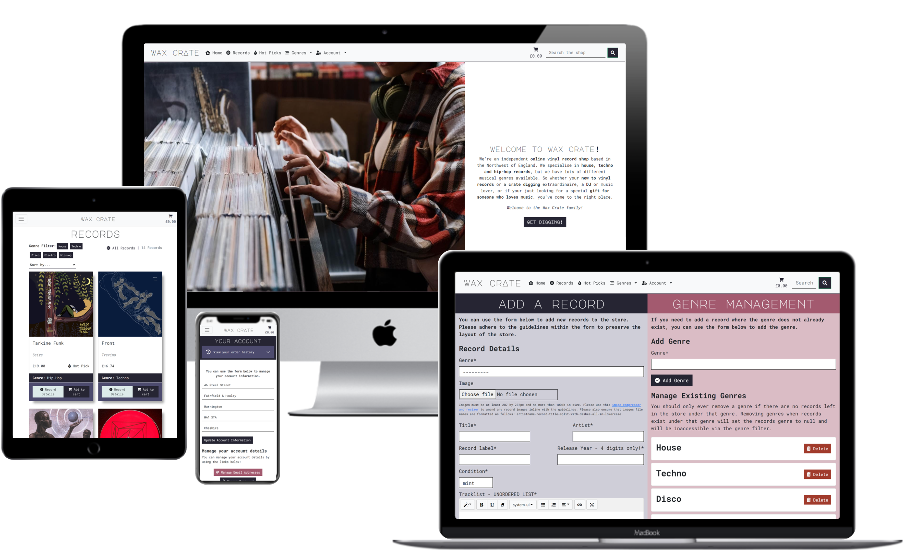
# **User Experience**
In this section, I will discuss the user experience considerations I implemented during the development process.
## **Strategy**
### **Business Goals**
In terms of business scope, this application provides many benefits:
* To provide the user with an intuitive easy to use website.
* To increase the sale of records through enticing content.
* Increase the sale of records through the ability to give customers a taste of the music prior to checkout.
* To introduce customers to new music they may like through reccomendations (hot picks).
* To allow customers ease of use via filtering, searching and sorting.

### **Marketing Strategy**
TALK ABOUT WEB MARKETING HERE
SOCIAL MEDIA
EMAIL MARKETING
SEO

### **User Stories**
Below are the user stories that needed to be fulfilled for the project to be successful from the perspective of the user and the store owner. There are 24 user stories in total broken down into five different epics:
| Wax Crate User Stories                          |          |                                                                                |                                                                                                                    |
|-------------------------------------------------|----------|--------------------------------------------------------------------------------|--------------------------------------------------------------------------------------------------------------------|
| ID                                              | As a….   | I want to be able to….                                                         | So that I can                                                                                                      |
| Viewing products and navigating around the site |          |                                                                                |                                                                                                                    |
| 1                                               | Customer | see some information about the store                                           | see whether they are trustworthy and a brand I want to purchase from.                                              |
| 2                                               | Customer | View the records that the store offers                                         | See if there are any records I want to purchase                                                                    |
| 3                                               | Customer | View some details about the record I've clicked on                             | understand whether the record will be to my taste.                                                                 |
| 4                                               | Customer | Look at what the shop reccomends from their catalog                            |  expand my musical taste and find new artists that I might like.                                                   |
| 5                                               | Customer | be able to access some of the music digitally                                  | Check if I like the record I'm thinking of purchasing.                                                             |
| 6                                               | Customer | see the price of records to know how much I'm potentially going to be spending | budget and prioritise what I'm purchasing where necessary                                                          |
| Registering, Sign in & Sign out                 |          |                                                                                |                                                                                                                    |
| 7                                               | User     | quickly register for an account                                                | Have my details saved                                                                                              |
| 8                                               | User     | log in and out                                                                 | to access my account and keep my details secure.                                                                   |
| 9                                               | User     | change my password via email                                                   | recover my account if I forget it.                                                                                 |
| 10                                              | User     | receive confirmation when I have registered                                    | can be sure that the site is reputable and verify my actions                                                       |
| 11                                              | User     | view my own profile                                                            | See my order history, update my information and let the shop know what my favourite music genre is                 |
| Sorting, filtering  and searching the site      |          |                                                                                |                                                                                                                    |
| 12                                              | Customer | Sort the list of records                                                       | dictate the order of the records in terms of price so I can get the best deal.                                     |
| 13                                              | Customer | filter the records based on their genre                                        | find records in the music genres I like.                                                                           |
| 14                                              | Customer | Search for records based on title and artist.                   | I can find singular records I'm looking for, records by artists I like or released by a record label that I like.  |
| 15                                              | Customer | See the amout of results my search/sort brought back                           | make a quick decision as to whether I want to scroll through the results.                                          |
| Purchasing and checking out                     |          |                                                                                |                                                                                                                    |
| 16                                              | Customer | Be able to increase and decrease the quantity of records                       | ensure that the amount of records I'm buying is actually what I want.                                              |
| 17                                              | Customer | View the records that I have put in my bag                                     | See the total of all my potential purchases and budget/prioritise as needed.                                       |
| 18                                              | Customer | Change the quantity of each record I have in the bag                           | make changes without going back and ensure I don’t purchase duplicates unnecessarily.                              |
| 19                                              | Customer | Enter my card information                                                      | pay for my records quickly and securely.                                                                           |
| 20                                              | Customer | View an order summary on checking out                                          | have one final review of my order and so I know that I need to contact the business if there are any problems.     |
| 21                                              | Customer | keep an email confirmation of my order                                         | have it to serve as a record of my purchase.                                                                       |
| Admin                                           |          |                                                                                |                                                                                                                    |
| 22                                              | owner    | Add new records to my store and categorise them accordingly                    | Any prospective customers have the most up to date music in a place where they expect to find it.                  |
| 23                                              | owner    | Update existing records on my store                                            | change its data, decription, images and information to fix problems and generate more business if it selling well. |
| 24                                              | owner    | Delete records that I no longer stock                                          | customers arent dissapointed when their order is cancelled due to no stock being available.                        |

Following the planning stage of the project, these user stories were added to Kanban boards on the GitHub repository so that I could adopt an agile approach and develop each piece of significant functionality at a time. You can access this Kanban boards via the projects tab on the GitHub repository or by clicking this <a href="https://github.com/JoelMichaelRutter/wax_crate_MS5/projects" target="_blank">link</a>.

<b>Kanban Board Images</b>

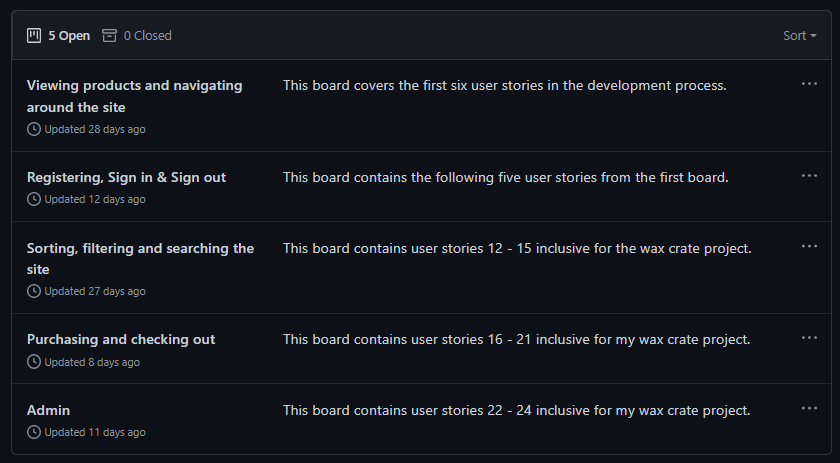
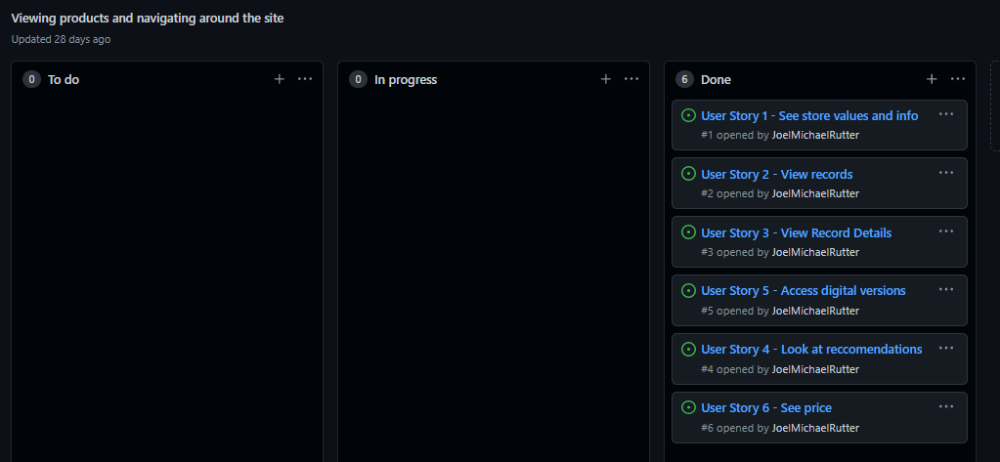
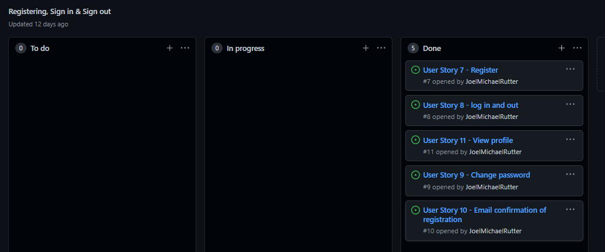
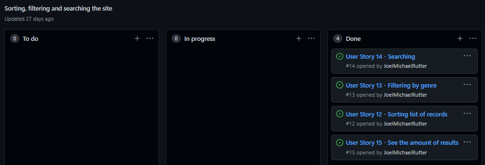
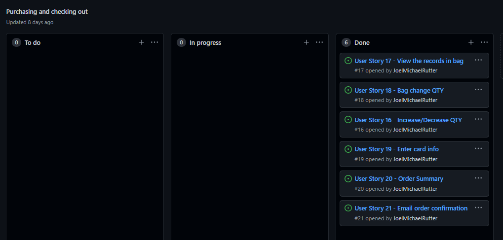
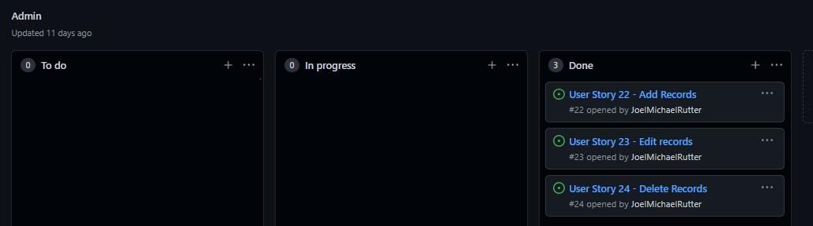

# **Structure Plane**  
I started my project by thinking about my user and the business function the user needs to satisfy. The main principles behind the development of the application were:
1. **Ease of use** – The application is easy to use and should be intuitive so that someone with little technical ability or exposure can pick it up straight away.
2. **Hip & Cool** – The user should feel as though the shop they are using is cool and hip.
3. **Minimal & Mono** – To contribute to the cool and hip feel, users should have minimal distraction, the focus should be on the music/records.

At the beginning of this project, I got all of my ideas out and created a plan with Microsoft Powerpoint. The first part of this plan consisted of a list around the technologies that I might use to develop the application. Please note, this was the planning stage and some of the technology may not have been used or more may have been added.

<b>Technology List Plan</b>

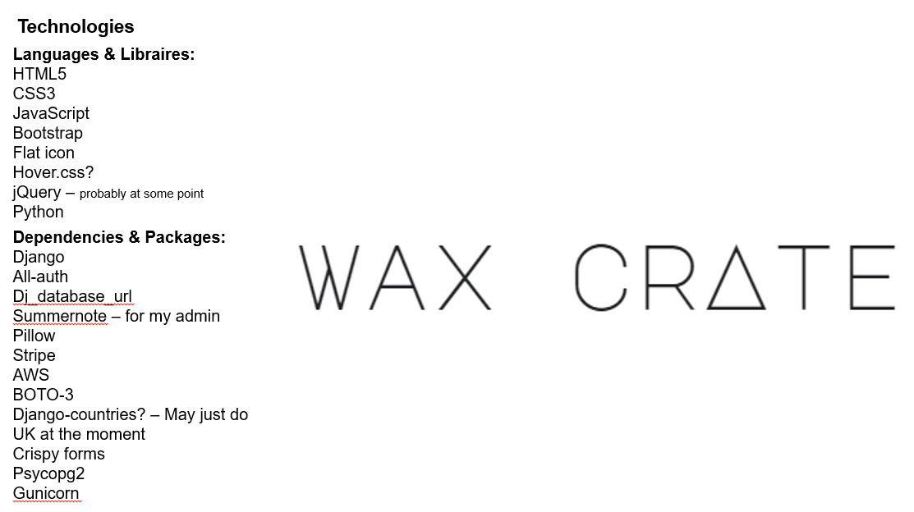

I also did some storyboarding around the types of fonts and images I would include with the site to further my planning.

<b>Story Board</b>

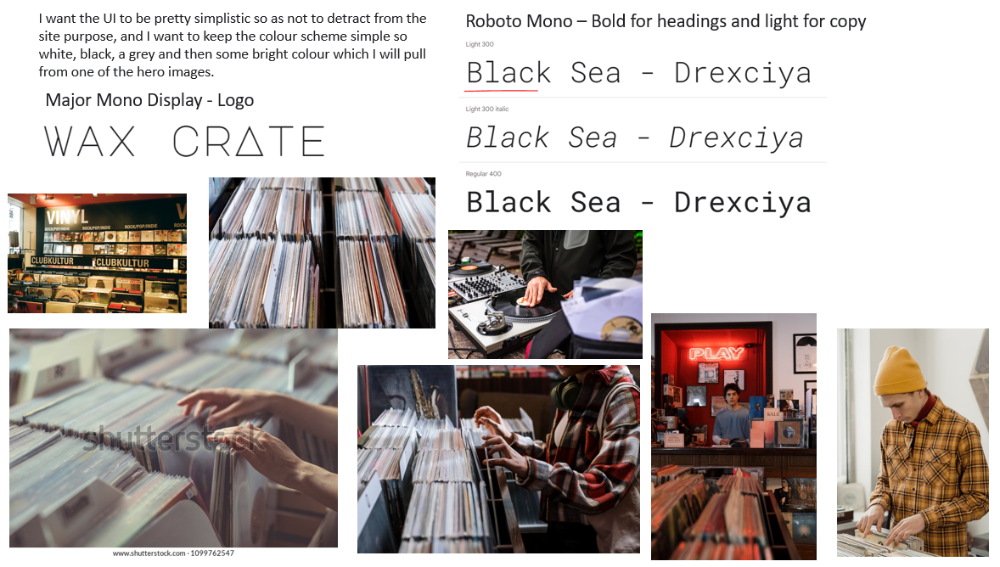

Before looking at the dataschema, I had a think about the overall structure of the django application I intended to build and the functionality that should be contained within each app. I created a mind map to get my ideas out of paper.

<b>Django Application Structure</b>

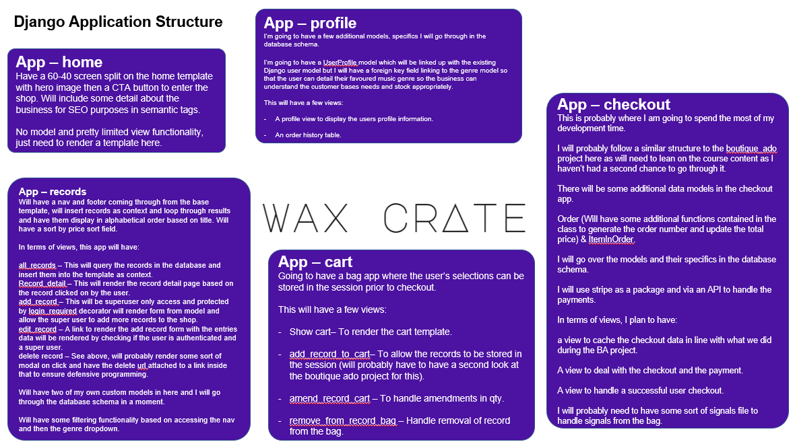

From here, I developed my database schema. I used a relational flowchart within Microsoft Visio to create the diagram.

<b>Database Schema</b>

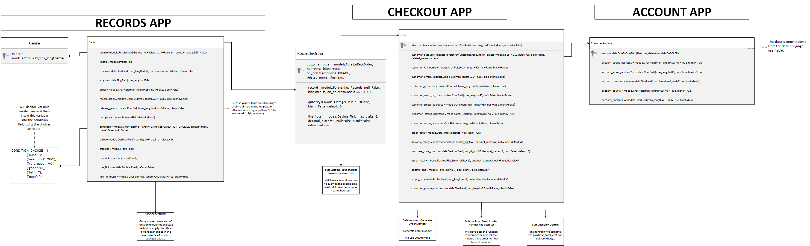

# **Skeleton Plane**
Now I had an idea of which technologies I would be using and what functionality I would need to develop to fufil the user stories, I proceeded to create some detailed wireframes. Each of the wireframes are set out below.

### **Wireframes**

<b>Mobile Phone Wireframes</b>

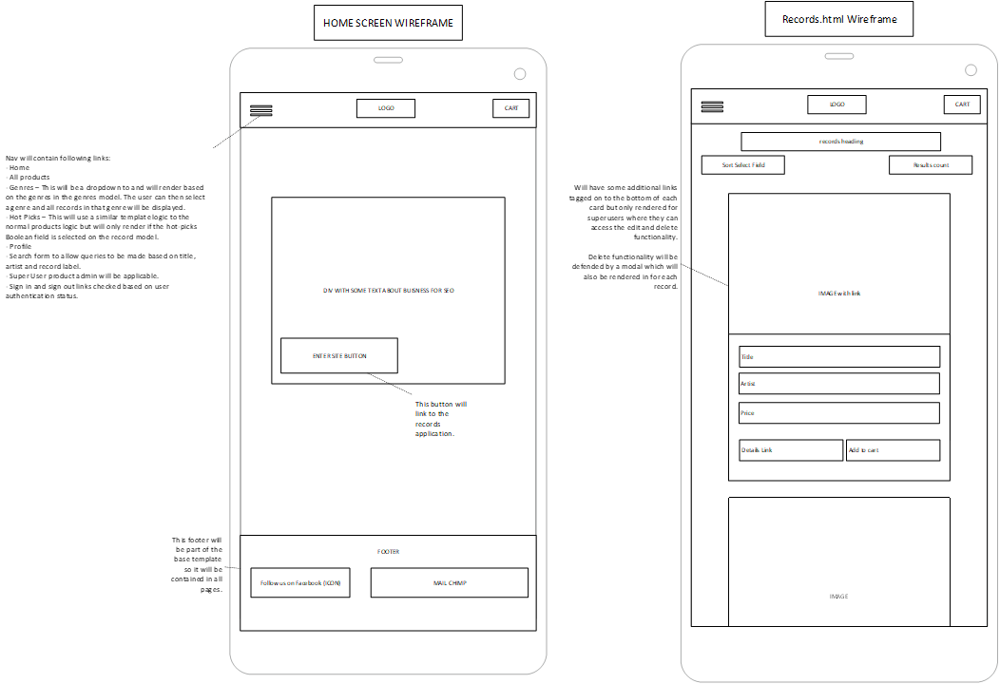
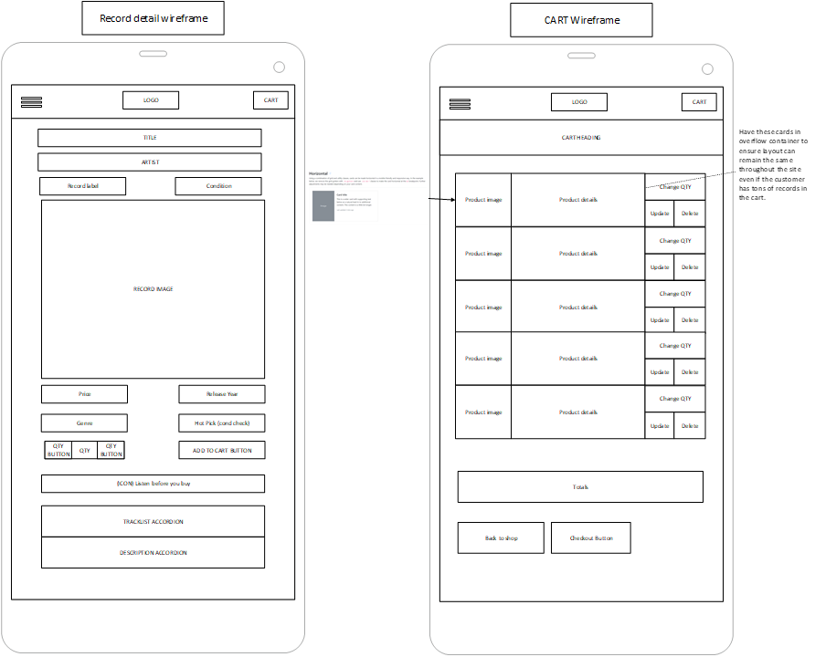

<b>Tablet Wireframes</b>

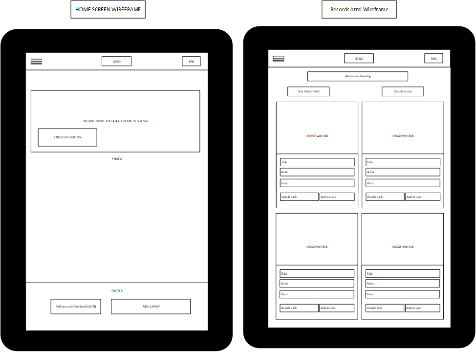
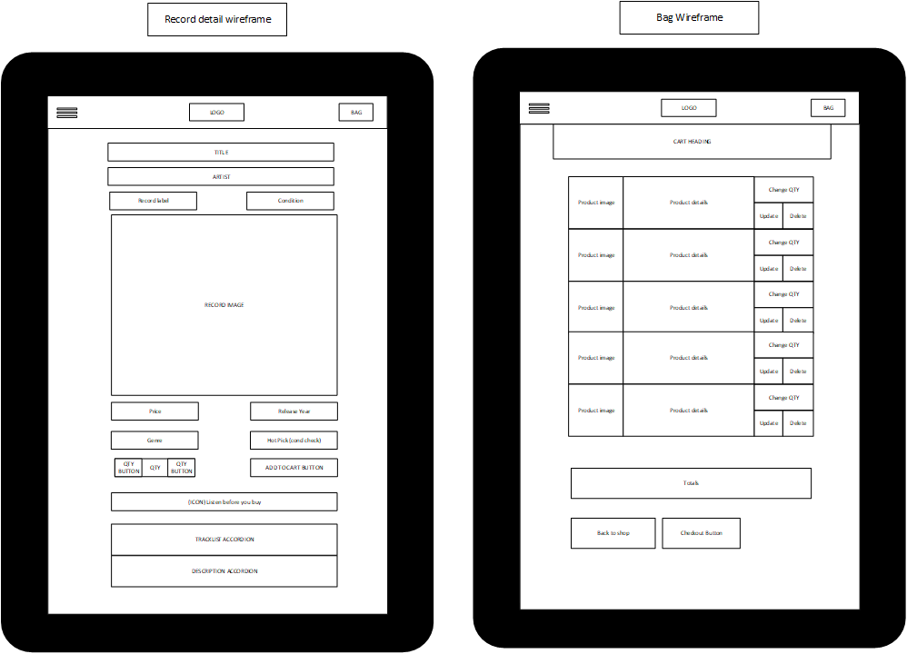
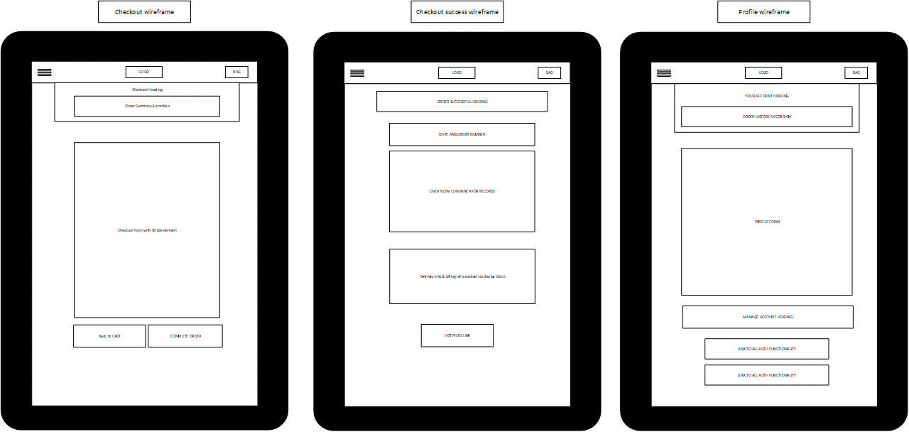

<b>Larger Screen Wireframes</b>

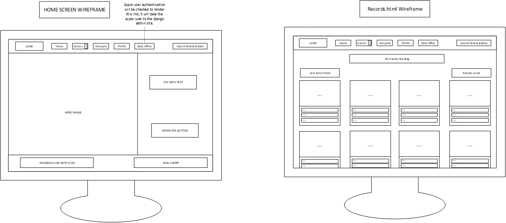
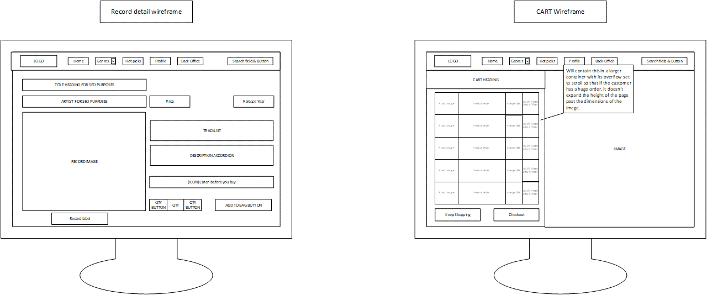

# **Design Features**
## **Colour Choices**
Below I will outline my colour choices for the project:

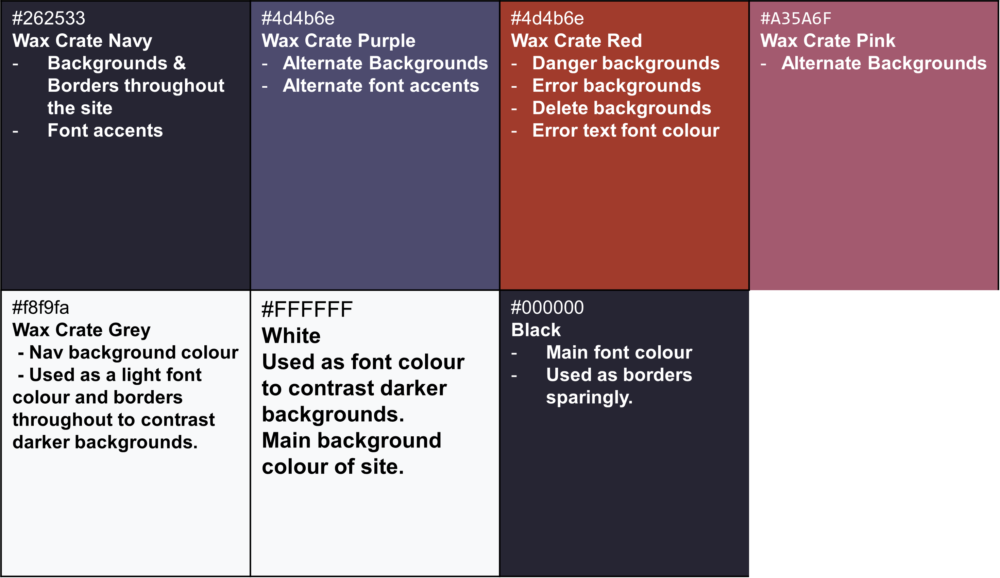  

In terms of tools, I used when it came to colours, I used:  
* **[ColourSpace](https://mycolor.space/)** to get complimentary alternate colours for my two main purple and navy background colours.

## **Imagery**
When it comes to Imagery, I used a variety of different sources.

### Hero Images
I obtained the hero images from the site from two different sources:
##### **Shutterstock**
* **Cart Hero Image** - This image can be found at this [link](https://www.shutterstock.com/image-photo/dj-studio-puts-needle-on-record-195717536)
* **Checkout Hero Image** - This image can be found at this [link](https://www.shutterstock.com/image-photo/professional-dj-turntable-on-flight-case-456251227)
* **Checkout Success Hero Image** - This image can be found at this [link](https://www.shutterstock.com/image-photo/young-man-vinyl-record-store-1996324145)
* **Account/Authorisation Image** - This image can be found at this [link](https://www.shutterstock.com/image-photo/womens-hands-browsing-records-vinyl-record-1099762547)

##### **Pexels**
* **Home Page Hero Image** - This image can be found at this [link](https://www.pexels.com/photo/person-in-red-and-white-plaid-shirt-checking-the-vinyl-record-6862369/)
* **Edit Record Page** - This image can be found at this [link](https://www.pexels.com/photo/people-vintage-school-music-8533552/)

### Record Images
In terms of the record images themselves, I sourced these from the relevant record pages on [Discogs](https://www.discogs.com/) which is a crowdsourced marketplace where users upload the artwork of the records they are selling publicly.

Just as a disclaimer, I do not own the rights to any of these images. They are being used for educational purposes only.

## **Iconography**	
In terms of iconography for the rest of the site, I used Font Awesome’s free library which is inserted via CDN in the base template head. You can find more information on how to sign up and use the service [here](https://fontawesome.com/).  
In terms of the specific icons, they can be located in the code within the classes of all "i" elements. 

## **Fonts**	
I chose two fonts for this project. I really wanted to stick to the themes I developed during my strategy planning, so I needed my fonts to be cool, hip, minimal and mono.

I used google fonts to find my fonts and I settled on the following two:

#### **Major Mono**
This was mainly used as my logo font but I did use it for some headings throughout the site.

#### **Major Mono**
This font was used as my main content font but I did use for some headings throughout the site.
To ensure that I had some versatility to play with, when importing Roboto Mono from Google Fonts, I used a few different weights ranging from 200 italic to 700 bold.

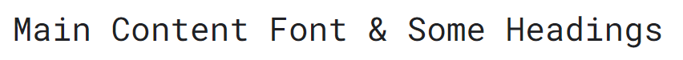

Once I had settled on these fonts, I added them as some helper classes at the top of my CSS file so that I could be really specific with my styling.
# **Data Schema & Functional Features**
## **Data Schema**
I'm going to take a moment to showcase the final data schema for the application in tables, app by app.

<b>Records App</b>

So there are two models at play here which link together. They are the Genre & Record models.
| Genre Model |                                  |                      |
|-------------|----------------------------------|----------------------|
| Field name  | Attributes                       | Related to           |
| genre       | models.CharField(max_length=254) | Record (foreign key) |

| Record Model  |                                                                                                    |                    |
|---------------|----------------------------------------------------------------------------------------------------|--------------------|
| Field name    | Attributes                                                                                         | Related to         |
| genre         | models.ForeignKey(Genre, null=False, blank=False, on_delete=SET_NULL                               | Genre(foreign key) |
| image         | models.ImageField(null=True, blank=True)                                                           |                    |
| title         | models.CharField(max_length=254, unique=True, null=False, blank=False)                             |                    |
| slug          | models.SlugField(max_length=254, unique=True)                                                      |                    |
| artist        | models.CharField(max_length=254, null=False, blank=False)                                          |                    |
| record_label  | models.CharField(max_length=254, null=False, blank=False)                                          |                    |
| release_year  | models.CharField(max_length=4, null=False, blank=False)                                            |                    |
| hot_pick      | models.BooleanField(default=False)                                                                 |                    |
| condition     | models.CharField(max_length=2, null=False, blank=False, choices=CONDITION_CHOICES, default='mint') |                    |
| price         | models.DecimalField(max_digits=6, decimal_places=2)                                                |                    |
| tracklist     | models.TextField()                                                                                 |                    |
| has_link      | models.BooleanField(default=False)                                                                 |                    |
| link_to_music | models.URLField(max_length=1024, null=True,                                                        |                    |

<b>Checkout App</b>

Again there are two related models here. They are the Order model and the LinesInOrder model. Essentially, the order is the larger model and an instance of the LinesInOrder model is created for each seperate record the customer purchases and is responsible for calculating the the total of each line which contributes to the order_total on the Order model. There's also a foreign key field to the CustomerAccount model on the order model for associating specific orders with a customers account so that it adds to their order history. 
| Order Model              |                                                                                                             |                 |
|--------------------------|-------------------------------------------------------------------------------------------------------------|-----------------|
| Field name               | Attributes                                                                                                  | Related to      |
| order_number             | models.CharField(max_length=32, null=False, editable=False)                                                 |                 |
| customer_account         | models.ForeignKey(CustomerAccount, on_delete=models.SET_NULL, null=True, blank=True, related_name='orders') | CustomerAccount |
| customer_full_name       | models.CharField, max_length=50, null=False, blank=False)                                                   |                 |
| customer_email           | models.EmailField(max_length=254, null=False, blank=False)                                                  |                 |
| customer_postcode        | models.CharField(max_length=20, null=False, blank=False)                                                    |                 |
| customer_town_or_city    | models.CharField(max_length=40, null=False, blank=False)                                                    |                 |
| customer_street_address1 | models.CharField(max_length=80, null=False, blank=False)                                                    |                 |
| customer_street_address2 | models.CharField(max_length=80, null=True, blank=True)                                                      |                 |
| customer_county          | models.CharField(max_length=80, null=True, blank=True)                                                      |                 |
| order_date               | models.DateField(auto_now_add=True)                                                                         |                 |
| purchase_total_cost      | models.DecimalField(max_digits=10, decimal_places=2, null=False, default=0)                                 |                 |
| delivery_charge          | models.DecimalField(max_digits=10, decimal_places=2, null=False, default=0)                                 |                 |
| order_total              | models.DecimalField(max_digits=10, decimal_places=2, null=False, default=0)                                 |                 |
| original_cart            | models.TextField(null=False, blank=False, default='')                                                       |                 |
| stripe_pid               | models.CharField(max_length=254, null=False, blank=False, default=””)                                       |                 |

| LinesInOrder Model |                                                                                                         |            |
|--------------------|---------------------------------------------------------------------------------------------------------|------------|
| Field name         | Attributes                                                                                              | Related to |
| customer_order     | models.ForeignKey(Order, null=False, blank=False, on_delete=models.CASCADE, related_name='order_lines’) | Order      |
| record             | models.ForeignKey(Record, null=False, blank=False, on_delete=models.CASCADE)                            | Record     |
| quantity           | models.IntegerField(null=False, blank=False)                                                            |            |
| line_total         | models.DecimalField(max_digits=6, decimal_places=2, null=False, blank=False, editable=False)            |            |

<b>Accounts App</b>

The final custom model in the application is the CustomerAccount model which creates a table to store the customer's default address.
| CustomerAccount Model   |                                                                                       |                                  |
|-------------------------|---------------------------------------------------------------------------------------|----------------------------------|
| Field name              | Attributes                                                                            | Related to                       |
| user                    | models.OneToOneField(User, on_delete=models.CASCADE, related_name='customer_account') | User (Django default user model) |
| account_street_address1 | models.CharField(max_length=80, null=True, blank=True)                                |                                  |
| account_street_address2 | models.CharField(max_length=80, null=True, blank=True)                                |                                  |
| account_town_or_city    | models.CharField(max_length=40, null=True, blank=True)                                |                                  |
| account_postcode        | models.CharField(max_length=20, null=True, blank=True)                                |                                  |
| account_county          | models.CharField(max_length=80, null=True, blank=True)                                |                                  |

## **Functional Features**
Within this section, I will break down the functions of the application. In the interests of brevity and as there are thousands of lines of backend code, I will show the templates where the user interacts with the functionality and discuss what the backend is doing as opposed to screenshotting the back end code and talking through it. If you want to take a more detailed look at the back end code, I will reference the files in question. The backend code is all commented up so its very clear what is happening as the flow progresses. I'll relate all of the relevant functionality back to my user stories to show you how they have been met. 

## **Base Template**
Let's kick things off with the base template. Theres actually a significant amount of functionality within the base template as it's really core to my business goals to have an easy to use and consistent site. So lots of the navigation functionality is contained within my base template. I've prepared an annotated screenshot to take a look at and I will point out the key areas of existing functionality.

1. **Logo** - So this is the main logo link, clicking it directs the user back to the home screen as is the norm with many websites.
2. **Home** - The home link does the same as above.
3. **Records** - (Satisfies User Story 2) The records link directs the user to the records.html page via the all_records view in views.py. **Hot Picks** - (Satisfies User Story 4) The hot picks link does a similar job to the records link but this time it sends a database query down the url so that the all_records view will only display those entries which have the hot pick boolean field set to true. This allows the record shop to select their hot picks and reccomend music to customers.
4. **Genres** - (Satisfies User Story 13) This bootstrap dropdown is populated via a context processor. You can find the logic for this in the contexts.py file in the records app. The processor gets all the objects out of the Genre table and allows all templates to access them via the "genres" template variable. In the base template, I loop through the genres template variable to create a link for each one. I also then add it to the database query within the link so that each genre pushes its respective text content into the URL to query the database. The all_records view then serves the records template but filters the entries down to those with genres matching the query.
5. **Account** - The content is dynamic here depending on the authentication status of the user and their permissions:
    * If the user is logged out, they'll see two links, one to sign in and one to register.
    * If the user is signed in but they don't have super user permissions, they'll see an accounts link when they can access their account and access the all off settings and they'll also have access to the sign out button as well
    * If the user has superuser permissions, they’ll see an additional link on top of the account link to “back office” This link will take them to a part of the apps CRUD functionality where superusers can add records and genres to the shop and also manage/delete the existing genres. it's worth noting here that the back office functionality is not only protected by the selective rendering of the HTML, it's also protected by the view serving the relevant parts of the crowd functionality asks the user isn't a super user they'll be directed back to the home screen and a message will be displayed to feedback. We’ll take a look at the back office template a bit further down the line.
6. **Cart Link** - (Satisfies User Story 17) - The content within this link updates every time a user adds something to the cart so the total beneath the little cart icon will update. If the user clicks this, they will be taken to the cart template where they can see items that they have in their current cart. The cart is just a dictionary of the record ids and the quantities stored in the session but the site unpacks it each time the cart is accessed and displays the information in a friendly way to the user.
7. **Search Form** - (Satisfies User Story 14) - This form allows the user to enter a custom search query to the database where the all records view will then use the django "Q" package to see if any of the database entries match in the "title" and "artist" field of the record model. It will then display any matches in the records template.
8. **Facebook Link** - This link directs the user to the businesses facebook page. It opens in a new tab so as not to take the user away from the application completley. This is part of my web marketing strategy.
9. **Mail Chimp Sign Up** - Another part of my marketing strategy is to sign customers up to a mailing list via this embedded mailchimp form. This again opens in a seperate tab if the user is not logged in and gets them to enter a few more details. These details can be accessed and used for marketing via the mail chimp dashboard.

## **Home App**
This app is quite simple. Through its single view it renders the following template.

1. **Hero Image** - I wanted customers and users to understand the purpose and context of the site straight away. What better way than with a large image of someone have a good dig through a crate of vinyl records just like they would do in a real record shop. Another word for vinyl is "Wax" hence the name "Wax Crate".
2. **Company Info** - (Satisfies User Story 1) In terms of SEO considerations, it's really important to ensure that information about the site and who the business is readily available. Thats why on the first page, I've included some company information contained within the types of semantic HTML elements that search engines look for. To add to that, I wove the short and longtail keywords I decided on during the planning stage into this content so as not to content stuff.
3. **Call to action button** - I wanted a definitive instruction to the user to be clear so included a call to action button to enter the site properly. This button serves the same purpose as the "records" link.

## **Records App**
There is a fair bit of functionality here, so stick with me.

### **Records**
The records template does quite alot of work in terms of the project. It gets rendered when all records are viewed and is responsible for displaying filtered, searched for and sorted results. I'll show the template and discuss the functionality below.

1. **Genre Filter** - (Satisfies User Story 13) This works just like the genre dropown in the nav, it's just easier for users to use this, especially on mobile. This filters down so that when a user filters down to "House" records, the rest of the buttons disappear to indicate to the user their current filtering critera.
2. **Filter Cancel, Record Counter & Search Query** - (Satisfies User Story 15) Over the other side of the viewport, I've provided a way for users to get back to an unfiltered view of the records in the shop. In addition to that, the amount of results returned from the filter or search query is displayed to the user. If there is a search query from the search form in the nav, the search query is displayed next to the amount of results to make it more specific to the user.
3. **Sort Selector** - (Satisfies User Story 12) This sort selection field allows users to sort the entries that they're viewing by price (high to low and vice vera), record title (a-z and vice versa) and artist (a-z and vice versa). Theres a small piece of javascript tacked on to the end of the template listening for the change event on this field and entering the different parameters into the URL so that the view can pick up on it and reload the page with the relevant sorting criteria. You can see the sorting area of the view in the all_records view within the records directory in the views.py file from lines 37-48.
* **Record Cards** - The record cards are really the focal point of the customer and user experience.

    4. **Record Details** - (Partially Satisfies User Story 3) When the user is browsing, they can either click the image or the record details button to go to the record_details template we will look at later. These links fire the slug (generated from the title of the record) down the URL so the view can locate the relevant record details. I opted for a slug here rather than the Django ID as it's friendlier to the user and would allow them to remember the URL a little easier.
    5. **Add to Cart** - This button allows users to quickly add a record to their cart. There is a hidden form here with a quantity input set to one. There is relevant messaging to the user when adding to the cart this way. If they add one record to the cart, and then click the button, the messaging is dynamic to show that they are adding additional copies of the record to their cart. This functionality contributes to the overall ecommerce aims of the site.
    6. **Edit Details** - (Partially Satisfies User Story 23) This button is only rendered for superusers, it accesses the edit_record view and serves the edit record template. Theres some redundancy included here as the view checks for superuser login to ensure that this functionality cannot be accessed by using the URL pattern. It fires the record ID down the URL and then the view accesses the record in the database and instatiates a form with the records data already pre-populated. We'll look more at this functionality later.
    7. **Delete** - (Satisfies User Story 24) Similar to the above functionality, this button is only rendered for superusers and the permissions of the user are checked within the delete_record view to ensure that the URL pattern cannot be entered by regular users to delete records from the shop. There's some defensive programming applied to this functionality. Clicking this button doesnt actually delete the record but instead triggers a modal with a warning which is demonstrated below.  
    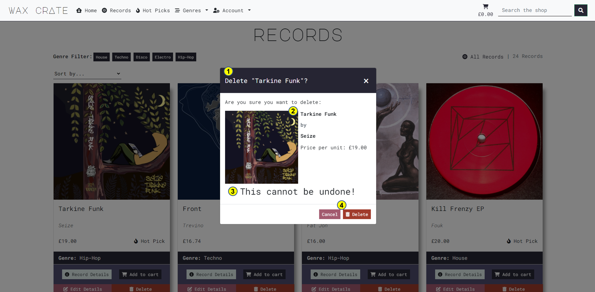
1. **Header** - To let the admin know which record they are deleting, I included the title of the record in the heading. 
2. **Record Image & Details** - Just to be really clear, to the admin which record is being deleted, I've included the record image and details to provide further context to which record will be deleted.
3. **Warning** - As a warning, I've advised that this action cannot be undone.
4. **Cancel & Delete** - The cancel button will dismis the modal, as will the cross button and clicking anywhere other than the modal container. The real delete button is housed within the modal. This fires the record id down the URL to the delete_record view which finds the entry within the database and calls the delete function. The admin is the redirected back to the records page with a feedback message displayed.
### **Record Details**
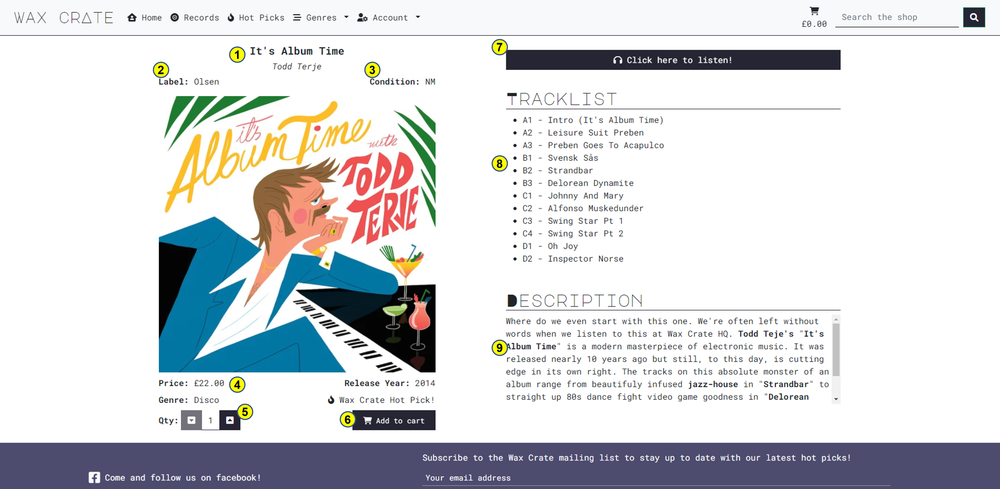

* **Record Details(1, 2, 3 & 4)** - (Satisfying User Stories 3 & 6) All the additional record information from the model can be seen in this detailed view such as record label, the condition of the records in stock, and the release year.
5. **Quantity Selector** -  (Satisfies User Story 16) I've created a neat quantity selector so that the user can use it to increase the quantity of records they want to add to the cart. It's controlled by some JavaScript which is added as a small include at the bottom of the DOM. The amount of records is limited to 10 of each record as anymore per customer becomes unrealistic. The buttons themselves become disabled at the relevant ranges (decrease reduced at qty of 1 and increase disabled at qty of 10). Further to that, theres some backend code withint the add_to_cart view within the cart app which checks how many copies of the record the user has in their cart already. Theres dynamic feedback messaging included with these views to ensure that the user is always being advised of how many copies they are adding to cart and restricting the user from adding more than 10 of a single record.
6. **Add to Cart Button** - This functions exactly like it does in the record carts only this time the quantity field is not hidden in the form and is controlled by the quantity selector.
7. **Listen to music button** - (Satisfies User Story 5) This link (styled as a button) allows users to access digital versions of the record on Spotify. This is rendered based on a truthy/falsy template check based on the boolean value of the has_link field on the model. If it has a link, the link is rendered in the button format. If not, it advises the user that we couldnt find a good quality link to the music. I decided to use Spotify for two reasons. Firstly, its the highest ranked music related redirect in terms of SEO so this should improve the SEO ranking and links like Youtube and Soundcloud arent as reliable as users can easliy take them down or they can be struck off for copyright infringment where as this happens much less with Spotify due to it being an official streaming channel. The Spotify browser version opens in a seperate tab whereas on mobile it will trigger the spotify app to open. A simple back button press will take the user back to the site on these occasions.
8. **Tracklist** - (Satisfies User Story 3) Here the user can see the tracklist for the record in question. The HTML isnt hard coded but applied to the database content via a summernote field.
9. **Description** - (Satisfies User Sotry 3) I wanted to ensure that there was some character in the store by explaining the stores take on the record in question. I've included custom descriptions for each of the records based on my own perception as the true store admin. Again this all populated via a summernote field so that the relevant keywords can be bolded inside the already semantic HTML without being hard coded, and as such, improving the pages SEO rankings. Again, where possible, I've weaved the keywords from my keyword research into there descriptions so as not to content stuff.

### **Back Office**
The Back Office serves as the main central hub for the store in terms of the CRUD functionality. Here, admins can add new records to the store, add new genres if the genre for the record they're adding doesnt exist and delete the existing genres if they are no longer needed. Below is the template (just note that I had to zoom out abit to fit it all on one screen shot). It's through this template that users can access the add_record view, the add_genre view and the delete_genre view.

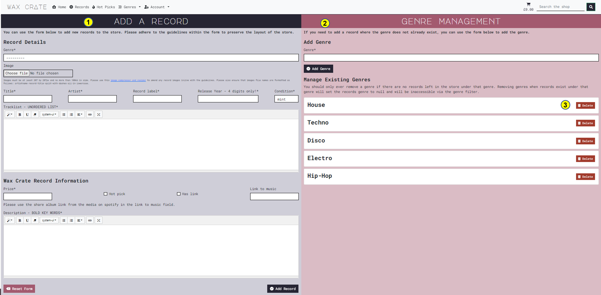

1. **Add Record Form** - (Satisfies User Story 22) This form is rendered directly from the Record model in the records forms.py file. Django is handling pretty much all the validation apart from on the release year, I've used some JavaScript to render a pattern attribute into the element and set its value to a regex pattern so that only digits are allowed in the field. I've used some widgets to replace the labels to provide a little more context to prospective admins about how to use the form. Also, to ensure that all the pages have a better SEO ranking without the neeed to hard code them, I've rendered in two Django Summernote widgets into tracklist and description fields respectively. You can find the documentation that I used to set up Summernote in this fashion at this GitHub repository. To summarise, I had to install summernote in the terminal, add it to the list of installed apps, add a bunch of settings which I then customised to the project level settings.py file, import the widgets at the top of the forms file and then call the widgets for those specific fields.

As the title of the records needs to be unique, I've added some try/except logic within the view for adding records where a record of the same title already exists. This logic catches the database integrity error and redirects the admin back to the back office page with an error message.

Provided that the form is all valid and there are no integrity/server errors, the admin will be directed to the all records page and a success messages is displayed. 

2. **Add Genre Form** - I didn't actually have this in my user stories, it was just a little something extra that I threw in as it's useful. This is another model form but this time its rendered from the Genre model. Using this form allows admins to add genres to the store where they dont already exist. So if the admin gets a record in stock that they want to add but the genre doesn't exist, they can quickly add it and provided the form is valid, they are redirected back to the back office screen with a success message where the genre will then be available in the genre dropdown of the record form.

3. **Delete Genre** - Again, some extra functionality that go beyond the defined user stories. Just like the delete record functionality, I've given admins the ability to remove genres from the store using this web interfact as opposed to the Django Admin. If there are records with a specific genre in the store and then the genre is deleted, those entries genres are set to null. I've added warnings and defensive programming to this. The delete genre button triggers a modal similar to the delete record funtionality. The admin is then warned that their actions could affect the integrity of the store and that the deletion cannot be undone. Then they have the delete button within the modal which fires the genre ID down the URL to the delete genre view where the genre is identified in the database and promptly deleted, the user is directed back to the back office page and a success message is displayed.

### **Edit Record**
The edit record page is an almost carbon copy of the back office page only it doesnt have the add or delete genre functionality. The template and its functional features are demonstrated below:

In the heading, there is a link **(1)** to take the admin back to shop (in case they click the wrong link).

Once accessed, the form uses the ID of the record that was selected to locate it in the database and then instantiates a record form with the instance of the record that has been located in the database. This then populates the form with the current records details so that the admin can amend them more easily **(2)**. You will notice **(3 & 4)** that any relevantly applied summernote styling is also carried across from the existing data **(4)**.

Finally, there is a button at the bottom of the form to update the record. Once clicked, provided that the form is valid, the details of that database entry are overwritten with the new data and the admin is redirected back to the records page and a success message is displayed.

## **Cart App**
### **Cart**

## **Checkout App**

### **Checkout**

### **Checkout Success**

## **Accounts App**
##

## **Additional Functionality**
### **Authentication**
There are three user stories which relate to authorisation. Authentication in terms of the functionality of the application is really important as whilst limited in scope,
there is customer data contained within the system so no unauthorised parties should be able to access it. I would also like to take this moment to note that whilst this
version of the application is deployed in Heroku, in a real-world scenario, no one in the public domain would be able to access this application due to its business focused
nature. As a result, this would be hosted internally on a secure business network. The three user stories which contain specifications requiring authentication are:

* **User Story:**

To summarise, allauth installs the back-end functionality and additional templates which are used to sign in, register and sign out of the application. All of the validation and backend functionality is handled by Django. I pulled these templates from their location within the allauth directory into my custom templates directory and added my own custom CSS and bootstrap classes.

### **Admin**
Within the application, I also installed some additional admin functionality. 
#### **Summernote**
I’ve installed the Django Summernote library to use in the admin.py file. There’s a full breakdown of the installation and implementation process for this library in the [deployment document](preperation-and-deployment.md). To summarise, I imported the SummerNoteAdmin class into the admin file and then used it in my ComplaintAdmin class to set up the functionality of the Admin site.
#### **Export**
The final feature I would like to talk about is additional and is not covered in any user story. It’s something I decided to add following the development of the functionality which finalised the user stories. Following a discussion at work about the application now that all other functionality was in place, a senior stakeholder asked me if it was possible to export data from the application so that it could be shared or manipulated by those without access to the admin site. This prompted me to go searching for a solution to this problem, as any good business application should have the ability to make it’s data accessible to whomever needs it. 

As a result, I installed the Django import-export library. A full explanation on the installation and implementation of this library can be found within the [deployment document](preperation-and-deployment.md).
# **Technologies Used**
Below I will list the variety of technology I used during the development process.
### **Operating Systems**

* **[Windows 10](https://www.microsoft.com/en-gb/windows/get-windows-10)**

### **GitPod** - was used as an Integrated Development Environment.  

### **Languages**

* **[Python](https://en.wikipedia.org/wiki/Python_(programming_language))**
* **[HTML5](https://en.wikipedia.org/wiki/HTML5)**
* **[CSS3](https://en.wikipedia.org/wiki/CSS)**
	* **[CSS Grid]( https://en.wikipedia.org/wiki/CSS_grid_layout)** – I used this for my data parent containers on larger screens to ensure that the layout of the application remained tidy and responsive even with variable amounts of data within the containers.
    * **[CSS Grid Generator]( https://cssgrid-generator.netlify.app/)** - To make things easier for myself, I used a CSS grid generator to create my grid containers.
* **[JavaScript](https://en.wikipedia.org/wiki/JavaScript)** - ES6 Syntax. I used some vanilla JavaScript to set a timeout function on my django messages.

### **Frameworks, Libraries & Dependencies**
#### **Backend**
* **[Django]( https://www.djangoproject.com/)** - This is the high-level python framework I used as the foundation of the project. It has a lot of useful pre-installed packages and shortcuts and is intended to be used for the rapid development of applications.
    * **[Django Summernote](https://github.com/summernote/django-summernote)** - This is a Django admin library that I installed to use in my admin site to implement search, list view and filter functionality.
    * **[Django all-auth](https://django-allauth.readthedocs.io/en/latest/overview.html)** - This is another Django library that handles the authentication and creation of users.
* **[Green Unicorn](https://gunicorn.org/)** - This is a Web Services Gateway Interface HTTP server which is commonly used to run Python web applications. 
* **[Dj-database-url](https://pypi.org/project/dj-database-url/)** - This Django library allows us to connect to an external database which in our case will be hosted on Heroku.
* **[psycopg2](https://pypi.org/project/psycopg2/)** - This package is one of the most popular database adapters for the python programming language which allows us to utilise a PostgreSQL database.
* **[PostgreSQL](https://www.postgresql.org/)** - The relational database management system used within this application.
#### Front end 
* **[Bootstrap]( https://getbootstrap.com/)** - a free and open-source CSS framework directed at responsive, mobile-first front-end web development. It contains CSS- and (optionally) JavaScript-based design templates for typography, forms, buttons, navigation, and other interface components.
* **[jQuery]( https://jquery.com/)** - 
* **[Google Fonts](https://fonts.google.com/)** - for typography
* **[Font Awesome](https://fontawesome.com/)** - for iconography  

### **Version Control**
* **[Git](https://en.wikipedia.org/wiki/Git)** - was used as a version control system.
* **[GitHub](https://en.wikipedia.org/wiki/GitHub)** - was used as a code repository.
### **Deployment**
* **[Heroku](https://en.wikipedia.org/wiki/Heroku)** – A cloud hosting service where the finalised application is deployed.
* **[Amazon Web Services S3]()** - 
### **Other**
* **[Microsoft Visio](https://en.wikipedia.org/wiki/Microsoft_Visio)** - Was used to create the front end wireframes and database schema.  
* **[Microsoft Powerpoint](https://en.wikipedia.org/wiki/Microsoft_PowerPoint)** - Used to plan the application features, the data model, write user stories, prepare images for use in this document, prepare the colour palette, write questions for my mentor and just general planning. 
* **[Microsoft Word](https://en.wikipedia.org/wiki/Microsoft_Word)** - I used this word processor to write the README files.
* **[Microsoft Excel](https://en.wikipedia.org/wiki/Microsoft_Excel)** - I used this spreadsheeting tool to create and complete my manual testing spreadsheet.

# **Application Testing**  
Please click [here](testing.md) to see a full breakdown of all testing completed on the application.

# **Preparing the workspace and deploying the application**
Please click [here](prep-and-deployment.md) to see a full explanation of the steps I took to prepare the workspace for development, how to perform an initial deployment, the integration and implementation of additional libraries as well as the final deployment of the application.

## **Forking the repository**
Should you wish to use the site code inside the repository without affecting the original repository, you can make a fork and create a copy of the repository which you can view and amend the code within. To create a fork, follow these steps:
1. Login to [GitHub](https://github.com/) and locate the [wax-crate-ms5](https://github.com/JoelMichaelRutter/wax_crate_MS5) repository.
2. In the top right-hand corner of the repository, you will see three buttons just below your profile icon. The rightmost button is called “fork”. Click this button.  
3. The repository will now be copied to your own GitHub account.

## **Cloning the repository**
You can create a clone of the repository inside your development environment. To do this, follow these steps:
1. Login to [GitHub](https://github.com/) and locate the [wax-crate-ms5](https://github.com/JoelMichaelRutter/wax_crate_MS5) repository.
2. Whilst in the repository, you will see the various files contained within. Above this list, you will see a button labelled “code”. The button will have a small download icon beside it.  
3.	When you click this icon, a small dropdown will open. Inside the dropdown will be the URL for the deployed site. Copy this URL by clicking the clipboard icon.  
4.	Open the Git Pod integrated development environment. 
5.	Whilst in the development environment, navigate to the bash terminal.
6.	In the bash terminal, enter “git clone”, then paste in the URL copied from the GitHub repository and hit enter.
7.	A clone of all files will now be pulled into the workspace.

It’s worth noting that you will also need to create your environment variables either via your IDE or an env.py file. You will also need to run the following command: pip3 install -r requirements.txt

The command above will download all the dependencies you need for a clone of the project in it’s current state based on the dependencies within the requirements.txt file.

# **Further Development Scope**

# **Project Reflection**

# **Project Credits**
## **Code**
In no particular order, I’d like to list the sources I pulled inspiration, code and debugging advice from.

# **Project Acknowledgements**
* **Code Institute Tutor Support** - For pushing me in the right direction with tricky bugs, I would specifically like to mention James, Sheryl and Igor who were sensational.
* **My Mentor** - As always for keeping me real, for his useful feedback and general greatness. 