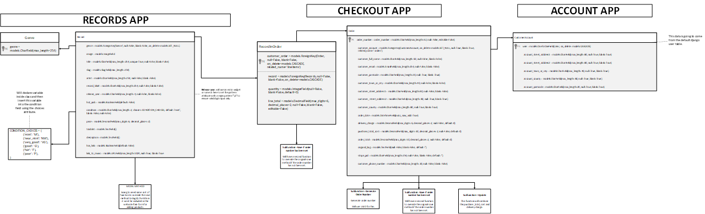

# **[Wax Crate](https://wax-crate-ms5.herokuapp.com/)**
Wax Crate is a business to consumer full stack e-commerce application that sells products (vinyl records). It offers the user a single payment transaction when they checkout. It’s a hip and cool online record shop. It specialises in bringing excellent music (specifically dance music such as house and techno and hip hop) to the masses.

It’s going to be of value to users who love vinyl, collecting records and crate digging to find new music. It will almost be hybrid and serve as a sort of music blog/shop as the product details will have personalised descriptions from the store owner about the product on sale with track reccomendations.

The user will be able to land on the site, view some information about what the business is about and then there will call to action button contained within the landing page enticing the user in.

## Table of contents
* ### [Deployed Site](#deployed-website)
* ### [Demo](#site-demonstration)
* ### [UX](#user-experience)
* ### [Design](#design-features)
* ### [Features](#functional-features)
* ### [Technologies](#technologies-used)
* ### [Testing](#application-testing)
* ### [Deployment](#deploying-the-site)
* ### [Further Development](#further-development-scope)
* ### [Reflection](#project-reflection)
* ### [Credits](#project-credits)
* ### [Acknowledgement](#project-acknowledgements)
# 
# [**Deployed Website**](https://wax-crate-ms5.herokuapp.com/)  
By clicking the hyperlinked header above, you can access the final deployed site hosted on Heroku.
# <a id="site-demonstration"> **Site Demonstration**</a>  

# **User Experience**
In this section, I will discuss the user experience considerations I implemented during the development process.
## **Strategy**
### **Business Goals**
In terms of business scope, this application provides many benefits:
* To provide the user with an intuitive easy to use website.
* To increase the sale of records through enticing content.
* Increase the sale of records through the ability to give customers a taste of the music prior to checkout.
* To introduce customers to new music they may like through reccomendations (hot picks).
* To allow customers ease of use via filtering, searching and sorting.
### **User Stories**
Below are the user stories that needed to be fulfilled for the project to be successful from the perspective of the user and the store owner. There are 24 user stories in total broken down into five different epics:
| Wax Crate User Stories                          |          |                                                                                |                                                                                                                    |
|-------------------------------------------------|----------|--------------------------------------------------------------------------------|--------------------------------------------------------------------------------------------------------------------|
| ID                                              | As a….   | I want to be able to….                                                         | So that I can                                                                                                      |
| Viewing products and navigating around the site |          |                                                                                |                                                                                                                    |
| 1                                               | Customer | see some information about the store                                           | see whether they are trustworthy and a brand I want to purchase from.                                              |
| 2                                               | Customer | View the records that the store offers                                         | See if there are any records I want to purchase                                                                    |
| 3                                               | Customer | View some details about the record I've clicked on                             | understand whether the record will be to my taste.                                                                 |
| 4                                               | Customer | Look at what the shop reccomends from their catalog                            |  expand my musical taste and find new artists that I might like.                                                   |
| 5                                               | Customer | be able to access some of the music digitally                                  | Check if I like the record I'm thinking of purchasing.                                                             |
| 6                                               | Customer | see the price of records to know how much I'm potentially going to be spending | budget and prioritise what I'm purchasing where necessary                                                          |
| Registering, Sign in & Sign out                 |          |                                                                                |                                                                                                                    |
| 7                                               | User     | quickly register for an account                                                | Have my details saved                                                                                              |
| 8                                               | User     | log in and out                                                                 | to access my account and keep my details secure.                                                                   |
| 9                                               | User     | change my password via email                                                   | recover my account if I forget it.                                                                                 |
| 10                                              | User     | receive confirmation when I have registered                                    | can be sure that the site is reputable and verify my actions                                                       |
| 11                                              | User     | view my own profile                                                            | See my order history, update my information and let the shop know what my favourite music genre is                 |
| Sorting, filtering  and searching the site      |          |                                                                                |                                                                                                                    |
| 12                                              | Customer | Sort the list of records                                                       | dictate the order of the records in terms of price so I can get the best deal.                                     |
| 13                                              | Customer | filter the records based on their genre                                        | find records in the music genres I like.                                                                           |
| 14                                              | Customer | Search for records based on title, artist and record label                     | I can find singular records I'm looking for, records by artists I like or released by a record label that I like.  |
| 15                                              | Customer | See the amout of results my search/sort brought back                           | make a quick decision as to whether I want to scroll through the results.                                          |
| Purchasing and checking out                     |          |                                                                                |                                                                                                                    |
| 16                                              | Customer | Be able to increase and decrease the quantity of records                       | ensure that the amount of records I'm buying is actually what I want.                                              |
| 17                                              | Customer | View the records that I have put in my bag                                     | See the total of all my potential purchases and budget/prioritise as needed.                                       |
| 18                                              | Customer | Change the quantity of each record I have in the bag                           | make changes without going back and ensure I don’t purchase duplicates unnecessarily.                              |
| 19                                              | Customer | Enter my card information                                                      | pay for my records quickly and securely.                                                                           |
| 20                                              | Customer | View an order summary on checking out                                          | have one final review of my order and so I know that I need to contact the business if there are any problems.     |
| 21                                              | Customer | keep an email confirmation of my order                                         | have it to serve as a record of my purchase.                                                                       |
| Admin                                           |          |                                                                                |                                                                                                                    |
| 22                                              | owner    | Add new records to my store and categorise them accordingly                    | Any prospective customers have the most up to date music in a place where they expect to find it.                  |
| 23                                              | owner    | Update existing records on my store                                            | change its data, decription, images and information to fix problems and generate more business if it selling well. |
| 24                                              | owner    | Delete records that I no longer stock                                          | customers arent dissapointed when their order is cancelled due to no stock being available.                        |

Following the planning stage of the project, these user stories were added to Kanban boards on the GitHub repository so that I could adopt an agile approach and develop each piece of significant functionality at a time. You can access this Kanban boards via the projects tab on the GitHub repository or by clicking this <a href="https://github.com/JoelMichaelRutter/wax_crate_MS5/projects" target="_blank">link</a>.

<b>Kanban Board Images</b>

# **Structure Plane**  
I started my project by thinking about my user and the business function the user needs to satisfy. The main principles behind the development of the application were:
1. **Ease of use** – The application is easy to use and should be intuitive so that someone with little technical ability or exposure can pick it up straight away.
2. **Hip & Cool** – The user should feel as though the shop they are using is cool and hip.
3. **Minimal & Mono** – To contribute to the cool and hip feel, users should have minimal distraction, the focus should be on the music/records.

At the beginning of this project, I got all of my ideas out and created a plan with Microsoft Powerpoint. The first part of this plan consisted of a list around the technologies that I might use to develop the application. Please note, this was the planning stage and some of the technology may not have been used or more may have been added.

<b>Technology List Plan</b>

I also did some storyboarding around the types of fonts and images I would include with the site to further my planning.

<b>Story Board</b>

Before looking at the dataschema, I had a think about the overall structure of the django application I intended to build and the functionality that should be contained within each app. I created a mind map to get my ideas out of paper.

<b>Django Application Structure</b>

From here, I developed my database schema. I used a relational flowchart within Microsoft Visio to create the diagram.

<b>Database Schema</b>

# **Skeleton Plane**
Now I had an idea of which technologies I would be using and what functionality I would need to develop to fufil the user stories, I proceeded to create some detailed wireframes. Each of the wireframes are set out below.

### **Wireframes**

<b>Mobile Phone Wireframes</b>

<b>Tablet Wireframes</b>

<b>Larger Screen Wireframes</b>

# **Design Features**
## **Colour Choices**
Below I will outline my colour choices for the project:

  

In terms of tools, I used when it came to colours, I used:  
* **[ColourSpace](https://mycolor.space/)** to get complimentary alternate colours for my two main purple and navy background colours.

## **Imagery**
When it comes to Imagery, I used a variety of different sources.

### Hero Images
I obtained the hero images from the site from two different sources:
##### **Shutterstock**
* **Cart Hero Image** - This image can be found at this [link](https://www.shutterstock.com/image-photo/dj-studio-puts-needle-on-record-195717536)
* **Checkout Hero Image** - This image can be found at this [link](https://www.shutterstock.com/image-photo/professional-dj-turntable-on-flight-case-456251227)
* **Checkout Success Hero Image** - This image can be found at this [link](https://www.shutterstock.com/image-photo/young-man-vinyl-record-store-1996324145)
* **Account/Authorisation Image** - This image can be found at this [link](https://www.shutterstock.com/image-photo/womens-hands-browsing-records-vinyl-record-1099762547)

##### **Pexels**
* **Home Page Hero Image** - This image can be found at this [link](https://www.pexels.com/photo/person-in-red-and-white-plaid-shirt-checking-the-vinyl-record-6862369/)
* **Edit Record Page** - This image can be found at this [link](https://www.pexels.com/photo/people-vintage-school-music-8533552/)

### Record Images
In terms of the record images themselves, I sourced these from the relevant record pages on [Discogs](https://www.discogs.com/) which is a crowdsourced marketplace where users upload the artwork of the records they are selling publicly.

Just as a disclaimer, I do not own the rights to any of these images. They are being used for educational purposes only.

## **Iconography**	
In terms of iconography for the rest of the site, I used Font Awesome’s free library which is inserted via CDN in the base template head. You can find more information on how to sign up and use the service [here](https://fontawesome.com/).  
In terms of the specific icons, they can be located in the code within the classes of all "i" elements. 

## **Fonts**	
I chose two fonts for this project. I really wanted to stick to the themes I developed during my strategy planning, so I needed my fonts to be cool, hip, minimal and mono.

I used google fonts to find my fonts and I settled on the following two:

#### **Major Mono**
This was mainly used as my logo font but I did use it for some headings throughout the site.

#### **Major Mono**
This font was used as my main content font but I did use for some headings throughout the site.
To ensure that I had some versatility to play with, when importing Roboto Mono from Google Fonts, I used a few different weights ranging from 200 italic to 700 bold.

Once I had settled on these fonts, I added them as some helper classes at the top of my CSS file so that I could be really specific with my styling.
# **Functional Features**
Within this section, I will break down the functions of the application. In the interests of brevity, I will show the front end and discuss what the backend is doing. If you want to take a more detailed look at the back end code, it is all commented up so its very clear what is happening as the flow progresses. I'll relate all of the relevant functionality back to my user stories to show you how they have been met. 

## **Base Template**

## **Home App**

## **Records App**

### **Records**

### **Record Details**

### **Back Office**

### **Edit Record**

## **Cart App**
### **Cart**

## **Checkout App**

### **Checkout**

### **Checkout Success**

## **Accounts App**
##

## **Additional Functionality**
### **Authentication**
There are three user stories which relate to authorisation. Authentication in terms of the functionality of the application is really important as whilst limited in scope,
there is customer data contained within the system so no unauthorised parties should be able to access it. I would also like to take this moment to note that whilst this
version of the application is deployed in Heroku, in a real-world scenario, no one in the public domain would be able to access this application due to its business focused
nature. As a result, this would be hosted internally on a secure business network. The three user stories which contain specifications requiring authentication are:

* **User Story:**

To summarise, allauth installs the back-end functionality and additional templates which are used to sign in, register and sign out of the application. All of the validation and backend functionality is handled by Django. I pulled these templates from their location within the allauth directory into my custom templates directory and added my own custom CSS and bootstrap classes.

### **Admin**
Within the application, I also installed some additional admin functionality. 
#### **Summernote**
I’ve installed the Django Summernote library to use in the admin.py file. There’s a full breakdown of the installation and implementation process for this library in the [deployment document](preperation-and-deployment.md). To summarise, I imported the SummerNoteAdmin class into the admin file and then used it in my ComplaintAdmin class to set up the functionality of the Admin site.
#### **Export**
The final feature I would like to talk about is additional and is not covered in any user story. It’s something I decided to add following the development of the functionality which finalised the user stories. Following a discussion at work about the application now that all other functionality was in place, a senior stakeholder asked me if it was possible to export data from the application so that it could be shared or manipulated by those without access to the admin site. This prompted me to go searching for a solution to this problem, as any good business application should have the ability to make it’s data accessible to whomever needs it. 

As a result, I installed the Django import-export library. A full explanation on the installation and implementation of this library can be found within the [deployment document](preperation-and-deployment.md).
# **Technologies Used**
Below I will list the variety of technology I used during the development process.
### **Operating Systems**

* **[Windows 10](https://www.microsoft.com/en-gb/windows/get-windows-10)**

### **GitPod** - was used as an Integrated Development Environment.  

### **Languages**

* **[Python](https://en.wikipedia.org/wiki/Python_(programming_language))**
* **[HTML5](https://en.wikipedia.org/wiki/HTML5)**
* **[CSS3](https://en.wikipedia.org/wiki/CSS)**
	* **[CSS Grid]( https://en.wikipedia.org/wiki/CSS_grid_layout)** – I used this for my data parent containers on larger screens to ensure that the layout of the application remained tidy and responsive even with variable amounts of data within the containers.
    * **[CSS Grid Generator]( https://cssgrid-generator.netlify.app/)** - To make things easier for myself, I used a CSS grid generator to create my grid containers.
* **[JavaScript](https://en.wikipedia.org/wiki/JavaScript)** - ES6 Syntax. I used some vanilla JavaScript to set a timeout function on my django messages.

### **Frameworks, Libraries & Dependencies**
#### **Backend**
* **[Django]( https://www.djangoproject.com/)** - This is the high-level python framework I used as the foundation of the project. It has a lot of useful pre-installed packages and shortcuts and is intended to be used for the rapid development of applications.
    * **[Django Summernote](https://github.com/summernote/django-summernote)** - This is a Django admin library that I installed to use in my admin site to implement search, list view and filter functionality.
    * **[Django all-auth](https://django-allauth.readthedocs.io/en/latest/overview.html)** - This is another Django library that handles the authentication and creation of users.
* **[Green Unicorn](https://gunicorn.org/)** - This is a Web Services Gateway Interface HTTP server which is commonly used to run Python web applications. 
* **[Dj-database-url](https://pypi.org/project/dj-database-url/)** - This Django library allows us to connect to an external database which in our case will be hosted on Heroku.
* **[psycopg2](https://pypi.org/project/psycopg2/)** - This package is one of the most popular database adapters for the python programming language which allows us to utilise a PostgreSQL database.
* **[PostgreSQL](https://www.postgresql.org/)** - The relational database management system used within this application.
#### Front end 
* **[Bootstrap]( https://getbootstrap.com/)** - a free and open-source CSS framework directed at responsive, mobile-first front-end web development. It contains CSS- and (optionally) JavaScript-based design templates for typography, forms, buttons, navigation, and other interface components.
* **[jQuery]( https://jquery.com/)** - This is arguably one of the most popular JavaScript libraries in use right now. I used it to toggle a class on my accordion headers when they are clicked and unclicked to signal to the user which complaints had been expanded. I used a CDN to implement the jQuery library in the base.html template.
* **[Google Fonts](https://fonts.google.com/)** - for typography
* **[Font Awesome](https://fontawesome.com/)** - for iconography  

### **Version Control**
* **[Git](https://en.wikipedia.org/wiki/Git)** - was used as a version control system.
* **[GitHub](https://en.wikipedia.org/wiki/GitHub)** - was used as a code repository.
### **Deployment**
* **[Heroku](https://en.wikipedia.org/wiki/Heroku)** – A cloud hosting service where the finalised application is deployed.
* **[Amazon Web Services S3]()** - 
### **Other**
* **[Microsoft Visio](https://en.wikipedia.org/wiki/Microsoft_Visio)** - Was used to create the front end wireframes.  
* **[Microsoft Powerpoint](https://en.wikipedia.org/wiki/Microsoft_PowerPoint)** - Used to plan the application features, the data model, write user stories, prepare images for use in this document, prepare the colour palette, write questions for my mentor and just general planning. 
* **[Microsoft Word](https://en.wikipedia.org/wiki/Microsoft_Word)** - I used this word processor to write the README files.
* **[Microsoft Excel](https://en.wikipedia.org/wiki/Microsoft_Excel)** - I used this spreadsheeting tool to create and complete my manual testing spreadsheet.

# **Application Testing**  
Please click [here](testing.md) to see a full breakdown of all testing completed on the application.

# **Preparing the workspace and deploying the application**
Please click [here](prep-and-deployment.md) to see a full explanation of the steps I took to prepare the workspace for development, how to perform an initial deployment, the integration and implementation of additional libraries as well as the final deployment of the application.

## **Forking the repository**
Should you wish to use the site code inside the repository without affecting the original repository, you can make a fork and create a copy of the repository which you can view and amend the code within. To create a fork, follow these steps:
1. Login to [GitHub](https://github.com/) and locate the [wax-crate-ms5](https://github.com/JoelMichaelRutter/wax_crate_MS5) repository.
2. In the top right-hand corner of the repository, you will see three buttons just below your profile icon. The rightmost button is called “fork”. Click this button.  
3. The repository will now be copied to your own GitHub account.

## **Cloning the repository**
You can create a clone of the repository inside your development environment. To do this, follow these steps:
1. Login to [GitHub](https://github.com/) and locate the [wax-crate-ms5](https://github.com/JoelMichaelRutter/wax_crate_MS5) repository.
2. Whilst in the repository, you will see the various files contained within. Above this list, you will see a button labelled “code”. The button will have a small download icon beside it.  
3.	When you click this icon, a small dropdown will open. Inside the dropdown will be the URL for the deployed site. Copy this URL by clicking the clipboard icon.  
4.	Open the Git Pod integrated development environment. 
5.	Whilst in the development environment, navigate to the bash terminal.
6.	In the bash terminal, enter “git clone”, then paste in the URL copied from the GitHub repository and hit enter.
7.	A clone of all files will now be pulled into the workspace.

It’s worth noting that you will also need to create your environment variables either via your IDE or an env.py file. You will also need to run the following command: pip3 install -r requirements.txt

The command above will download all the dependencies you need for a clone of the project in it’s current state based on the dependencies within the requirements.txt file.

# **Further Development Scope**

# **Project Reflection**

# **Project Credits**
## **Code**
In no particular order, I’d like to list the sources I pulled inspiration, code and debugging advice from.

# **Project Acknowledgements**
* **Code Institute Tutor Support** - For pushing me in the right direction with tricky bugs, I would specifically like to mention James, Sheryl and Igor who were sensational.
* **My Mentor** - As always for keeping me real, for his useful feedback and general greatness. 