# **[Wax Crate](https://wax-crate-ms5.herokuapp.com/)**
Wax Crate is a business to consumer full stack e-commerce application that sells products (vinyl records). It offers the user a single payment transaction when they checkout. It’s a hip and cool online record shop. It specialises in bringing excellent music (specifically dance music such as house and techno and hip hop) to the masses.

It’s going to be of value to users who love vinyl, collecting records and crate digging to find new music. It will almost be hybrid and serve as a sort of music blog/shop as the product details will have personalised descriptions from the store owner about the product on sale with track reccomendations.

The user will be able to land on the site, view some information about what the business is about and then there will call to action button contained within the landing page enticing the user in.

## Table of contents
* ### [Deployed Site](#deployed-website)
* ### [Demo](#site-demonstration)
* ### [UX](#user-experience)
* ### [Design](#design-features)
* ### [Features](#functional-features)
* ### [Technologies](#technologies-used)
* ### [Testing](#application-testing)
* ### [Deployment](#deploying-the-site)
* ### [Further Development](#further-development-scope)
* ### [Reflection](#project-reflection)
* ### [Credits](#project-credits)
* ### [Acknowledgement](#project-acknowledgements)
# 
# [**Deployed Website**](https://wax-crate-ms5.herokuapp.com/)  
By clicking the hyperlinked header above, you can access the final deployed site hosted on Heroku.
# <a id="site-demonstration"> **Site Demonstration**</a>  

# **User Experience**
In this section, I will discuss the user experience considerations I implemented during the development process.
## **Strategy**
### **Business Goals**
In terms of business scope, this application provides many benefits:
* To provide the user with an intuitive easy to use website.
* To increase the sale of records through enticing content.
* Increase the sale of records through the ability to give customers a taste of the music prior to checkout.
* To introduce customers to new music they may like through reccomendations (hot picks).
* To allow customers ease of use via filtering, searching and sorting.

### **Marketing Strategy**
TALK ABOUT WEB MARKETING HERE
SOCIAL MEDIA
EMAIL MARKETING
SEO

### **User Stories**
Below are the user stories that needed to be fulfilled for the project to be successful from the perspective of the user and the store owner. There are 24 user stories in total broken down into five different epics:

| Wax Crate User Stories                          |          |                                                                                |                                                                                                                    |
|-------------------------------------------------|----------|--------------------------------------------------------------------------------|--------------------------------------------------------------------------------------------------------------------|
| ID                                              | As a….   | I want to be able to….                                                         | So that I can                                                                                                      |
| Viewing products and navigating around the site |          |                                                                                |                                                                                                                    |
| 1                                               | Customer | see some information about the store                                           | see whether they are trustworthy and a brand I want to purchase from.                                              |
| 2                                               | Customer | View the records that the store offers                                         | See if there are any records I want to purchase                                                                    |
| 3                                               | Customer | View some details about the record I've clicked on                             | understand whether the record will be to my taste.                                                                 |
| 4                                               | Customer | Look at what the shop reccomends from their catalog                            |  expand my musical taste and find new artists that I might like.                                                   |
| 5                                               | Customer | be able to access some of the music digitally                                  | Check if I like the record I'm thinking of purchasing.                                                             |
| 6                                               | Customer | see the price of records to know how much I'm potentially going to be spending | budget and prioritise what I'm purchasing where necessary                                                          |
| Registering, Sign in & Sign out                 |          |                                                                                |                                                                                                                    |
| 7                                               | User     | quickly register for an account                                                | Have my details saved                                                                                              |
| 8                                               | User     | log in and out                                                                 | to access my account and keep my details secure.                                                                   |
| 9                                               | User     | change my password via email                                                   | recover my account if I forget it.                                                                                 |
| 10                                              | User     | receive a confirmation email when I have registered                            | can be sure that the site is reputable and verify my actions                                                       |
| 11                                              | User     | view my own profile                                                            | See my order history and update my information account information.                                                |
| Sorting, filtering  and searching the site      |          |                                                                                |                                                                                                                    |
| 12                                              | Customer | Sort the list of records                                                       | dictate the order of the records in terms of price so I can get the best deal.                                     |
| 13                                              | Customer | filter the records based on their genre                                        | find records in the music genres I like.                                                                           |
| 14                                              | Customer | Search for records based on title, artist.                                     | I can find singular records I'm looking for, records by artists I like.                                            |
| 15                                              | Customer | See the amout of results my search/sort brought back                           | make a quick decision as to whether I want to scroll through the results.                                          |
| Purchasing and checking out                     |          |                                                                                |                                                                                                                    |
| 16                                              | Customer | Be able to increase and decrease the quantity of records                       | ensure that the amount of records I'm buying is actually what I want.                                              |
| 17                                              | Customer | View the records that I have put in my bag                                     | See the total of all my potential purchases and budget/prioritise as needed.                                       |
| 18                                              | Customer | Change the quantity of each record I have in the bag                           | make changes without going back and ensure I don’t purchase duplicates unnecessarily.                              |
| 19                                              | Customer | Enter my card information                                                      | pay for my records quickly and securely.                                                                           |
| 20                                              | Customer | View an order summary on checking out                                          | have one final review of my order and so I know that I need to contact the business if there are any problems.     |
| 21                                              | Customer | keep an email confirmation of my order                                         | have it to serve as a record of my purchase.                                                                       |
| Admin                                           |          |                                                                                |                                                                                                                    |
| 22                                              | owner    | Add new records to my store and categorise them accordingly                    | Any prospective customers have the most up to date music in a place where they expect to find it.                  |
| 23                                              | owner    | Update existing records on my store                                            | change its data, decription, images and information to fix problems and generate more business if it selling well. |
| 24                                              | owner    | Delete records that I no longer stock                                          | customers arent dissapointed when their order is cancelled due to no stock being available.                        |

Following the planning stage of the project, these user stories were added to Kanban boards on the GitHub repository so that I could adopt an agile approach and develop each piece of significant functionality at a time. You can access this Kanban boards via the projects tab on the GitHub repository or by clicking this <a href="https://github.com/JoelMichaelRutter/wax_crate_MS5/projects" target="_blank">link</a>.

<b>Kanban Board Images</b>

# **Structure Plane**  
I started my project by thinking about my user and the business function the user needs to satisfy. The main principles behind the development of the application were:
1. **Ease of use** – The application is easy to use and should be intuitive so that someone with little technical ability or exposure can pick it up straight away.
2. **Hip & Cool** – The user should feel as though the shop they are using is cool and hip.
3. **Minimal & Mono** – To contribute to the cool and hip feel, users should have minimal distraction, the focus should be on the music/records.

At the beginning of this project, I got all of my ideas out and created a plan with Microsoft Powerpoint. The first part of this plan consisted of a list around the technologies that I might use to develop the application. Please note, this was the planning stage and some of the technology may not have been used or more may have been added.

<b>Technology List Plan</b>

I also did some storyboarding around the types of fonts and images I would include with the site to further my planning.

<b>Story Board</b>

Before looking at the dataschema, I had a think about the overall structure of the django application I intended to build and the functionality that should be contained within each app. I created a mind map to get my ideas out of paper.

<b>Django Application Structure</b>

From here, I developed my database schema. I used a relational flowchart within Microsoft Visio to create the diagram.

<b>Database Schema</b>

# **Skeleton Plane**
Now I had an idea of which technologies I would be using and what functionality I would need to develop to fufil the user stories, I proceeded to create some detailed wireframes. Each of the wireframes are set out below.

### **Wireframes**

<b>Mobile Phone Wireframes</b>

<b>Tablet Wireframes</b>

<b>Larger Screen Wireframes</b>

# **Design Features**
## **Colour Choices**
Below I will outline my colour choices for the project:

  

In terms of tools, I used when it came to colours, I used:  
* **[ColourSpace](https://mycolor.space/)** to get complimentary alternate colours for my two main purple and navy background colours.

## **Imagery**
When it comes to Imagery, I used a variety of different sources.

### Hero Images
I obtained the hero images from the site from two different sources:
##### **Shutterstock**
* **Cart Hero Image** - This image can be found at this [link](https://www.shutterstock.com/image-photo/dj-studio-puts-needle-on-record-195717536)
* **Checkout Hero Image** - This image can be found at this [link](https://www.shutterstock.com/image-photo/professional-dj-turntable-on-flight-case-456251227)
* **Checkout Success Hero Image** - This image can be found at this [link](https://www.shutterstock.com/image-photo/young-man-vinyl-record-store-1996324145)
* **Account/Authorisation Image** - This image can be found at this [link](https://www.shutterstock.com/image-photo/womens-hands-browsing-records-vinyl-record-1099762547)

##### **Pexels**
* **Home Page Hero Image** - This image can be found at this [link](https://www.pexels.com/photo/person-in-red-and-white-plaid-shirt-checking-the-vinyl-record-6862369/)
* **Edit Record Page** - This image can be found at this [link](https://www.pexels.com/photo/people-vintage-school-music-8533552/)

### Record Images
In terms of the record images themselves, I sourced these from the relevant record pages on [Discogs](https://www.discogs.com/) which is a crowdsourced marketplace where users upload the artwork of the records they are selling publicly.

Just as a disclaimer, I do not own the rights to any of these images. They are being used for educational purposes only.

## **Iconography**	
In terms of iconography for the rest of the site, I used Font Awesome’s free library which is inserted via CDN in the base template head. You can find more information on how to sign up and use the service [here](https://fontawesome.com/).  
In terms of the specific icons, they can be located in the code within the classes of all "i" elements. 

## **Fonts**	
I chose two fonts for this project. I really wanted to stick to the themes I developed during my strategy planning, so I needed my fonts to be cool, hip, minimal and mono.

I used google fonts to find my fonts and I settled on the following two:

#### **Major Mono**
This was mainly used as my logo font but I did use it for some headings throughout the site.

#### **Major Mono**
This font was used as my main content font but I did use for some headings throughout the site.
To ensure that I had some versatility to play with, when importing Roboto Mono from Google Fonts, I used a few different weights ranging from 200 italic to 700 bold.

Once I had settled on these fonts, I added them as some helper classes at the top of my CSS file so that I could be really specific with my styling.
# **Data Schema & Functional Features**
## **Data Schema**
I'm going to take a moment to showcase the final data schema for the application in tables, app by app.

<b>Records App</b>

So there are two models at play here which link together. They are the Genre & Record models.
| Genre Model |                                  |                      |
|-------------|----------------------------------|----------------------|
| Field name  | Attributes                       | Related to           |
| genre       | models.CharField(max_length=254) | Record (foreign key) |

| Record Model  |                                                                                                    |                    |
|---------------|----------------------------------------------------------------------------------------------------|--------------------|
| Field name    | Attributes                                                                                         | Related to         |
| genre         | models.ForeignKey(Genre, null=False, blank=False, on_delete=SET_NULL                               | Genre(foreign key) |
| image         | models.ImageField(null=True, blank=True)                                                           |                    |
| title         | models.CharField(max_length=254, unique=True, null=False, blank=False)                             |                    |
| slug          | models.SlugField(max_length=254, unique=True)                                                      |                    |
| artist        | models.CharField(max_length=254, null=False, blank=False)                                          |                    |
| record_label  | models.CharField(max_length=254, null=False, blank=False)                                          |                    |
| release_year  | models.CharField(max_length=4, null=False, blank=False)                                            |                    |
| hot_pick      | models.BooleanField(default=False)                                                                 |                    |
| condition     | models.CharField(max_length=2, null=False, blank=False, choices=CONDITION_CHOICES, default='mint') |                    |
| price         | models.DecimalField(max_digits=6, decimal_places=2)                                                |                    |
| tracklist     | models.TextField()                                                                                 |                    |
| has_link      | models.BooleanField(default=False)                                                                 |                    |
| link_to_music | models.URLField(max_length=1024, null=True,                                                        |                    |

<b>Checkout App</b>

Again there are two related models here. They are the Order model and the LinesInOrder model. Essentially, the order is the larger model and an instance of the LinesInOrder model is created for each seperate record the customer purchases and is responsible for calculating the the total of each line which contributes to the order_total on the Order model. There's also a foreign key field to the CustomerAccount model on the order model for associating specific orders with a customers account so that it adds to their order history. 
| Order Model              |                                                                                                             |                 |
|--------------------------|-------------------------------------------------------------------------------------------------------------|-----------------|
| Field name               | Attributes                                                                                                  | Related to      |
| order_number             | models.CharField(max_length=32, null=False, editable=False)                                                 |                 |
| customer_account         | models.ForeignKey(CustomerAccount, on_delete=models.SET_NULL, null=True, blank=True, related_name='orders') | CustomerAccount |
| customer_full_name       | models.CharField, max_length=50, null=False, blank=False)                                                   |                 |
| customer_email           | models.EmailField(max_length=254, null=False, blank=False)                                                  |                 |
| customer_postcode        | models.CharField(max_length=20, null=False, blank=False)                                                    |                 |
| customer_town_or_city    | models.CharField(max_length=40, null=False, blank=False)                                                    |                 |
| customer_street_address1 | models.CharField(max_length=80, null=False, blank=False)                                                    |                 |
| customer_street_address2 | models.CharField(max_length=80, null=True, blank=True)                                                      |                 |
| customer_county          | models.CharField(max_length=80, null=True, blank=True)                                                      |                 |
| order_date               | models.DateField(auto_now_add=True)                                                                         |                 |
| purchase_total_cost      | models.DecimalField(max_digits=10, decimal_places=2, null=False, default=0)                                 |                 |
| delivery_charge          | models.DecimalField(max_digits=10, decimal_places=2, null=False, default=0)                                 |                 |
| order_total              | models.DecimalField(max_digits=10, decimal_places=2, null=False, default=0)                                 |                 |
| original_cart            | models.TextField(null=False, blank=False, default='')                                                       |                 |
| stripe_pid               | models.CharField(max_length=254, null=False, blank=False, default=””)                                       |                 |

| LinesInOrder Model |                                                                                                         |            |
|--------------------|---------------------------------------------------------------------------------------------------------|------------|
| Field name         | Attributes                                                                                              | Related to |
| customer_order     | models.ForeignKey(Order, null=False, blank=False, on_delete=models.CASCADE, related_name='order_lines’) | Order      |
| record             | models.ForeignKey(Record, null=False, blank=False, on_delete=models.CASCADE)                            | Record     |
| quantity           | models.IntegerField(null=False, blank=False)                                                            |            |
| line_total         | models.DecimalField(max_digits=6, decimal_places=2, null=False, blank=False, editable=False)            |            |

<b>Accounts App</b>

The final custom model in the application is the CustomerAccount model which creates a table to store the customer's default address.
| CustomerAccount Model   |                                                                                       |                                  |
|-------------------------|---------------------------------------------------------------------------------------|----------------------------------|
| Field name              | Attributes                                                                            | Related to                       |
| user                    | models.OneToOneField(User, on_delete=models.CASCADE, related_name='customer_account') | User (Django default user model) |
| account_street_address1 | models.CharField(max_length=80, null=True, blank=True)                                |                                  |
| account_street_address2 | models.CharField(max_length=80, null=True, blank=True)                                |                                  |
| account_town_or_city    | models.CharField(max_length=40, null=True, blank=True)                                |                                  |
| account_postcode        | models.CharField(max_length=20, null=True, blank=True)                                |                                  |
| account_county          | models.CharField(max_length=80, null=True, blank=True)                                |                                  |

## **Functional Features**
Within this section, I will break down the functions of the application. In the interests of brevity and as there are thousands of lines of backend code, I will show the templates where the user interacts with the functionality and discuss what the backend is doing as opposed to screenshotting the back end code and talking through it. If you want to take a more detailed look at the back end code, I will reference the files in question. The backend code is all commented up so its very clear what is happening as the flow progresses. I'll relate all of the relevant functionality back to my user stories to show you how they have been met. 

## **Base Template**
Let's kick things off with the base template. Theres actually a significant amount of functionality within the base template as it's really core to my business goals to have an easy to use and consistent site. So lots of the navigation functionality is contained within my base template. I've prepared an annotated screenshot to take a look at and I will point out the key areas of existing functionality.

1. **Logo** - So this is the main logo link, clicking it directs the user back to the home screen as is the norm with many websites.
2. **Home** - The home link does the same as above.
3. **Records** - (Satisfies User Story 2) The records link directs the user to the records.html page via the all_records view in views.py. **Hot Picks** - (Satisfies User Story 4) The hot picks link does a similar job to the records link but this time it sends a database query down the url so that the all_records view will only display those entries which have the hot pick boolean field set to true. This allows the record shop to select their hot picks and reccomend music to customers.
4. **Genres** - (Satisfies User Story 13) This bootstrap dropdown is populated via a context processor. You can find the logic for this in the contexts.py file in the records app. The processor gets all the objects out of the Genre table and allows all templates to access them via the "genres" template variable. In the base template, I loop through the genres template variable to create a link for each one. I also then add it to the database query within the link so that each genre pushes its respective text content into the URL to query the database. The all_records view then serves the records template but filters the entries down to those with genres matching the query.
5. **Account** - The content is dynamic here depending on the authentication status of the user and their permissions:
    * If the user is logged out, they'll see two links, one to sign in and one to register.
    * If the user is signed in but they don't have super user permissions, they'll see an accounts link when they can access their account and access the all off settings and they'll also have access to the sign out button as well
    * If the user has superuser permissions, they’ll see an additional link on top of the account link to “back office” This link will take them to a part of the apps CRUD functionality where superusers can add records and genres to the shop and also manage/delete the existing genres. it's worth noting here that the back office functionality is not only protected by the selective rendering of the HTML, it's also protected by the view serving the relevant parts of the crowd functionality asks the user isn't a super user they'll be directed back to the home screen and a message will be displayed to feedback. We’ll take a look at the back office template a bit further down the line.
6. **Cart Link** - (Satisfies User Story 17) - The content within this link updates every time a user adds something to the cart so the total beneath the little cart icon will update. If the user clicks this, they will be taken to the cart template where they can see items that they have in their current cart. The cart is just a dictionary of the record ids and the quantities stored in the session but the site unpacks it each time the cart is accessed and displays the information in a friendly way to the user.
7. **Search Form** - (Satisfies User Story 14) - This form allows the user to enter a custom search query to the database where the all records view will then use the django "Q" package to see if any of the database entries match in the "title" and "artist" field of the record model. It will then display any matches in the records template.
8. **Facebook Link** - This link directs the user to the businesses facebook page. It opens in a new tab so as not to take the user away from the application completley. This is part of my web marketing strategy.
9. **Mail Chimp Sign Up** - Another part of my marketing strategy is to sign customers up to a mailing list via this embedded mailchimp form. This again opens in a seperate tab if the user is not logged in and gets them to enter a few more details. These details can be accessed and used for marketing via the mail chimp dashboard.

## **Home App**
This app is quite simple. Through its single view it renders the following template.

1. **Hero Image** - I wanted customers and users to understand the purpose and context of the site straight away. What better way than with a large image of someone have a good dig through a crate of vinyl records just like they would do in a real record shop. Another word for vinyl is "Wax" hence the name "Wax Crate".
2. **Company Info** - (Satisfies User Story 1) In terms of SEO considerations, it's really important to ensure that information about the site and who the business is readily available. Thats why on the first page, I've included some company information contained within the types of semantic HTML elements that search engines look for. To add to that, I wove the short and longtail keywords I decided on during the planning stage into this content so as not to content stuff.
3. **Call to action button** - (Partially satisfies User Story 2) I wanted a definitive instruction to the user to be clear so included a call to action button to enter the site properly. This button serves the same purpose as the "records" link.

## **Records App**
There is a fair bit of functionality here, so stick with me.

### **Records**
The records template does quite alot of work in terms of the project. It gets rendered when all records are viewed and is responsible for displaying unfiltered, filtered, searched for and sorted results. I'll show the template and discuss the functionality below. In general, all of this functionality satisfies User Story 2.

1. **Genre Filter** - (Satisfies User Story 13) This works just like the genre dropown in the nav, it's just easier for users to use this, especially on mobile. This filters down so that when a user filters down to "House" records, the rest of the buttons disappear to indicate to the user their current filtering critera.
2. **Filter Cancel, Record Counter & Search Query** - (Satisfies User Story 15) Over the other side of the viewport, I've provided a way for users to get back to an unfiltered view of the records in the shop. In addition to that, the amount of results returned from the filter or search query is displayed to the user. If there is a search query from the search form in the nav, the search query is displayed next to the amount of results to make it more specific to the user.
3. **Sort Selector** - (Satisfies User Story 12) This sort selection field allows users to sort the entries that they're viewing by price (high to low and vice vera), record title (a-z and vice versa) and artist (a-z and vice versa). Theres a small piece of javascript tacked on to the end of the template listening for the change event on this field and entering the different parameters into the URL so that the view can pick up on it and reload the page with the relevant sorting criteria. You can see the sorting area of the view in the all_records view within the records directory in the views.py file from lines 37-48.
* **Record Cards** - The record cards are really the focal point of the customer and user experience.

    4. **Record Details** - (Partially Satisfies User Story 3) When the user is browsing, they can either click the image or the record details button to go to the record_details template we will look at later. These links fire the slug (generated from the title of the record) down the URL so the view can locate the relevant record details. I opted for a slug here rather than the Django ID as it's friendlier to the user and would allow them to remember the URL a little easier.
    5. **Add to Cart** - This button allows users to quickly add a record to their cart. There is a hidden form here with a quantity input set to one. There is relevant messaging to the user when adding to the cart this way. If they add one record to the cart, and then click the button, the messaging is dynamic to show that they are adding additional copies of the record to their cart. This functionality contributes to the overall ecommerce aims of the site.
    6. **Edit Details** - (Partially Satisfies User Story 23) This button is only rendered for superusers, it accesses the edit_record view and serves the edit record template. Theres some redundancy included here as the view checks for superuser login to ensure that this functionality cannot be accessed by using the URL pattern. It fires the record ID down the URL and then the view accesses the record in the database and instatiates a form with the records data already pre-populated. We'll look more at this functionality later.
    7. **Delete** - (Satisfies User Story 24) Similar to the above functionality, this button is only rendered for superusers and the permissions of the user are checked within the delete_record view to ensure that the URL pattern cannot be entered by regular users to delete records from the shop. There's some defensive programming applied to this functionality. Clicking this button doesnt actually delete the record but instead triggers a modal with a warning which is demonstrated below.  
    
1. **Header** - To let the admin know which record they are deleting, I included the title of the record in the heading. 
2. **Record Image & Details** - Just to be really clear, to the admin which record is being deleted, I've included the record image and details to provide further context to which record will be deleted.
3. **Warning** - As a warning, I've advised that this action cannot be undone.
4. **Cancel & Delete** - The cancel button will dismis the modal, as will the cross button and clicking anywhere other than the modal container. The real delete button is housed within the modal. This fires the record id down the URL to the delete_record view which finds the entry within the database and calls the delete function. The admin is the redirected back to the records page with a feedback message displayed.
### **Record Details**

* **Record Details(1, 2, 3 & 4)** - (Satisfying User Stories 3 & 6) All the additional record information from the model can be seen in this detailed view such as record label, the condition of the records in stock, and the release year.
5. **Quantity Selector** -  (Satisfies User Story 16) I've created a neat quantity selector so that the user can use it to increase the quantity of records they want to add to the cart. It's controlled by some JavaScript which is added as a small include at the bottom of the DOM. The amount of records is limited to 10 of each record as anymore per customer becomes unrealistic. The buttons themselves become disabled at the relevant ranges (decrease reduced at qty of 1 and increase disabled at qty of 10). Further to that, theres some backend code withint the add_to_cart view within the cart app which checks how many copies of the record the user has in their cart already. Theres dynamic feedback messaging included with these views to ensure that the user is always being advised of how many copies they are adding to cart and restricting the user from adding more than 10 of a single record.
6. **Add to Cart Button** - This functions exactly like it does in the record carts only this time the quantity field is not hidden in the form and is controlled by the quantity selector.
7. **Listen to music button** - (Satisfies User Story 5) This link (styled as a button) allows users to access digital versions of the record on Spotify. This is rendered based on a truthy/falsy template check based on the boolean value of the has_link field on the model. If it has a link, the link is rendered in the button format. If not, it advises the user that we couldnt find a good quality link to the music. I decided to use Spotify for two reasons. Firstly, its the highest ranked music related redirect in terms of SEO so this should improve the SEO ranking and links like Youtube and Soundcloud arent as reliable as users can easliy take them down or they can be struck off for copyright infringment where as this happens much less with Spotify due to it being an official streaming channel. The Spotify browser version opens in a seperate tab whereas on mobile it will trigger the spotify app to open. A simple back button press will take the user back to the site on these occasions.
8. **Tracklist** - (Satisfies User Story 3) Here the user can see the tracklist for the record in question. The HTML isnt hard coded but applied to the database content via a summernote field.
9. **Description** - (Satisfies User Sotry 3) I wanted to ensure that there was some character in the store by explaining the stores take on the record in question. I've included custom descriptions for each of the records based on my own perception as the true store admin. Again this all populated via a summernote field so that the relevant keywords can be bolded inside the already semantic HTML without being hard coded, and as such, improving the pages SEO rankings. Again, where possible, I've weaved the keywords from my keyword research into there descriptions so as not to content stuff.

### **Back Office**
The Back Office serves as the main central hub for the store in terms of the CRUD functionality. Here, admins can add new records to the store, add new genres if the genre for the record they're adding doesnt exist and delete the existing genres if they are no longer needed. Below is the template (just note that I had to zoom out abit to fit it all on one screen shot). It's through this template that users can access the add_record view, the add_genre view and the delete_genre view. All the CRUD functionalites are secured via login required decorators and super user conditional checks within the views.

1. **Add Record Form** - (Satisfies User Story 22) This form is rendered directly from the Record model in the records forms.py file. Django is handling pretty much all the validation apart from on the release year, I've used some JavaScript to render a pattern attribute into the element and set its value to a regex pattern so that only digits are allowed in the field. I've used some widgets to replace the labels to provide a little more context to prospective admins about how to use the form. Also, to ensure that all the pages have a better SEO ranking without the neeed to hard code them, I've rendered in two Django Summernote widgets into tracklist and description fields respectively. You can find the documentation that I used to set up Summernote in this fashion at this [GitHub](https://github.com/summernote/django-summernote) repository. To summarise, I had to install summernote in the terminal, add it to the list of installed apps, add a bunch of settings which I then customised to the project level settings.py file, import the widgets at the top of the forms file and then call the widgets for those specific fields.

As the title of the records needs to be unique, I've added some try/except logic within the view for adding records where a record of the same title already exists. This logic catches the database integrity error and redirects the admin back to the back office page with an error message.

Provided that the form is all valid and there are no integrity/server errors, the admin will be directed to the all records page and a success messages is displayed. 

2. **Add Genre Form** - I didn't actually have this in my user stories, it was just a little something extra that I threw in as it's useful. This is another model form but this time its rendered from the Genre model. Using this form allows admins to add genres to the store where they dont already exist. So if the admin gets a record in stock that they want to add but the genre doesn't exist, they can quickly add it and provided the form is valid, they are redirected back to the back office screen with a success message where the genre will then be available in the genre dropdown of the record form.

3. **Delete Genre** - Again, some extra functionality that go beyond the defined user stories. Just like the delete record functionality, I've given admins the ability to remove genres from the store using this web interfact as opposed to the Django Admin. If there are records with a specific genre in the store and then the genre is deleted, those entries genres are set to null. I've added warnings and defensive programming to this. The delete genre button triggers a modal similar to the delete record funtionality. The admin is then warned that their actions could affect the integrity of the store and that the deletion cannot be undone. Then they have the delete button within the modal which fires the genre ID down the URL to the delete genre view where the genre is identified in the database and promptly deleted, the user is directed back to the back office page and a success message is displayed.

### **Edit Record**
The edit record page is an almost carbon copy of the back office page only it doesnt have the add or delete genre functionality. This functionality satisfies User Story 23. The template and its functional features are demonstrated below:

In the heading, there is a link **(1)** to take the admin back to shop (in case they click the wrong link).

Once accessed, the form uses the ID of the record that was selected to locate it in the database and then instantiates a record form with the instance of the record that has been located in the database. This then populates the form with the current records details so that the admin can amend them more easily **(2)**. You will notice **(3 & 4)** that any relevantly applied summernote styling is also carried across from the existing data **(4)**.

Finally, there is a button at the bottom of the form to update the record. Once clicked, provided that the form is valid, the details of that database entry are overwritten with the new data and the admin is redirected back to the records page and a success message is displayed.

## **Cart App**
### **Cart**

1. **Messaging** - Here is an example of the messaging framework at work throughout the site. In this paticular example, the user has changed the quantity of one of the records via the amend_cart view in the cart views.py file. The messaging across the app is dynamic and feedback to the user what actions they are taken.

2. **Quantity Selector** - (Satisfies User Story 18) This quantity selector works in pretty much the same way as the record details page only in this instance the submission of the form is being handled by a small piece of JavaScript attached to the bottom of the page. I'll talk more about that next. The form has a class with the record id for the record in that specific line so that it can be matched up with the relevant button and also used to remove the relevant record from the cart dictionary in the session.

3. **Update & Delete Buttons** (Satisfies User Story 18) These buttons are being listened to by some javascript at the bottom of the template. Each update button has the corresponding record id in the class. The JavaScript gets the record id by splitting the update buttons id. It then finds the form with the corresponding number at the end of the class and issues the submit command. This then fires the record id down the amend_cart URL into the corresponding view which then updates the quantity of that record id in the cart within session. For the delete button, things are slightly more complicated. As the delete button isnt technically part of the form, the JavaScript requires the CSRF token to submit data to the relevant URL. The delete buttons are all labeled up with the record IDs which is then accessed via the split method in the JavaScript. I've then created a URL that the JS form needs to submit to (which is the URL for the remove_from_cart view) and then passed in the record ID which is expected as parameter. From there, I call the submit method, passing the record id as the data and the CSRF token. Once the record has been removed, the page is reloaded via the JavaScript and the message from the view is then pushed to the user to inform them that the record has been removed.

4. **Cart Item Cards** - (Satisfies User Story 17) Moving on from the Cart Link in the nav, the user gets a more detailed view of the records they have in their cart by seeing the image, the important record details and then the price per unit. These cards are contained within a container with a fixed height and an overflow set as it would quickly become tedious for a user who had a large amount of records in their cart to scroll up and down their cart. It's worth noting here that all the records in the cart are being accessed via a context processor so that the totals and records can be accessed on every template in the application. All i've done to create this list of records in the bag is loop through the records_in_cart and render a card with a quantity and delete form for each one.

5. **Totals** - (Contributes to fulfillment of User Story 6) - These totals allow the user to see how much their total spend will be. There is a free delivery setting that you cant see in the example as it only renders when the user has less than £80.00 of records in the cart which informs them how much more they would need to spend to get free delivery. These totals update as record quantities are updated.

6. **Back to shop** - This link is a really simple piece of functionality to take the user back to the all records page without having to use the navigation.

7. **Checkout Button** - This button allows the user to advance to the checkout functionality once they are satisified with the contents of their cart.

## **Checkout App**
### **Checkout**

1. **Order Summary Accordion** - (Satisfies User Story 20) In this accordion, the records in the cart are looped through and displayed in the same fashion as in the cart only here they are accessed via the accordion. This functionality gives the user a final chance to review their purchases and quantities before they checkout.

2. **Checkout Form** - This form is contributing to the whole eccomerce aim of the application. This form is rendered from the Order model via the forms.py file in the checkout app. There's alot of redundancy built into the form and functionality here which I will explain below. When this form is instantiated, it checks if the user has a customer account and if so, it grabs the instance of the customer account in question and instantiates the form with those details prepopulated.

3. **Stripe Element** - (Satisifies User Story 19) This stripe element is rendered directly from stripe via the Stripe JS package. The submission of the form overall is handled by the stripe_element.js functionality. Theres tons to go through here so I will keep things as brief as I can. When the page is loaded, the Stripe element creates a "payment intent" which is essentially a dictionary of information that can be sent over to the Stripe platform to complete the payment. There are the Stripe environment variables injected into the DOM as context by the checkout which are then accessed with the JavaScript handling the form submission. hen the user enters their card informaton, and submits the form, the stripe elements js file attempts to send the information over to stripe. To ensure that the user can't duplicate the form submission, this form hanler overlays the screen with a neat loading overlay with a spinning record. If there is an error, the page is re-enabled and the error is disiplayed in the errors div directly below the stripe element. If the payment is good to go, Stripe sends out a webhook to grab the payment from the app. All of this functionality is handled by the following files: [stripe_elements.js](checkout/static/checkout/js/stripe_element.js), [webhooks.py](checkout/webhooks.py) and [webhook_handler.py](checkout/webhook_handler.py).

Theres some redundancy in place in terms of stripe whereby if the user does not checkout successfully, my custom webhook handler for successful payment intents will check the Orders table in the database over a period of five seconds and if it cannot find a matching order based on the original stripe payment intent ID, order number or original cart items that created it, it will send a signal to the model to create the order based on the metadata stuffed into the stripe payment intent.

Just to demonstrate that the application is successfully integrated with Stripe, you can see an order on one side and the subsequent stripe event at the webhook URL below (note the amounts):

| Order Confirmation screen                                  | Stripe Payment Intent                                         |
|------------------------------------------------------------|---------------------------------------------------------------|
| 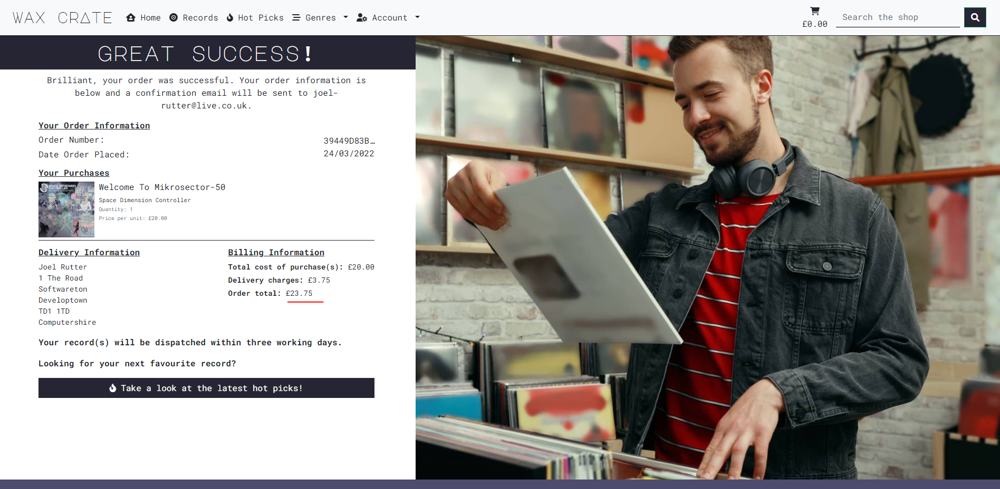  | 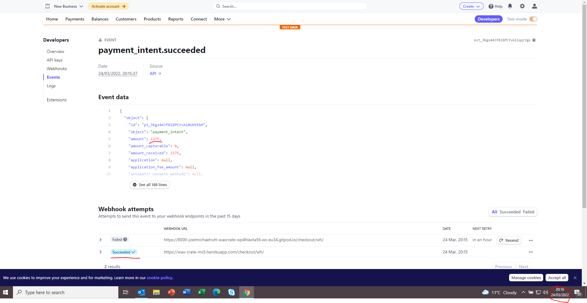 |

5. **Save Info** - I have a save information checkbox which is only rendered for authenticated users which is also handled by the checkout view and webhook handlers. If set to true on the form submission, it will store the information within the checkout form within the Customer Account model. I'm going to demonstrate this functionality later.

6. **Order Total** - As a final confirmation before the submission button, I've got a nice contrasting banner to show the user the total that their card will be charged.

7. **Back to cart** - This button allows the user to go back to amend their cart if they need to.

8. **Place Order** - This button submits the checkout form and triggers the stripe elements javascript file to take over and trigger the loading overlay.

### **Checkout Success**

1. **Email Confirmation** - (Satisfies User Story 21) This functionality can't be seen in terms of the template on show above but it's handled by the private _send_confirmation_email function within the webhook_handler.py file and then executed within the handle_payment_intent_succeeded method. It takes the order instance for that order and enters the relevant information into two text files in the conf emails directory via context and uses the django send_mail function and render_to_string method to send this as an email to the customer. You can see a screenshot of an example confirmation email below.

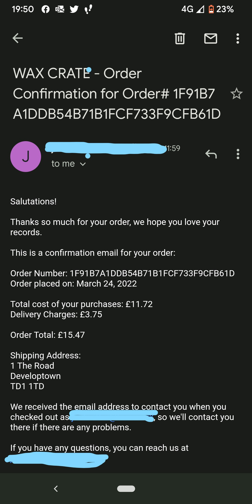

* **(2, 3, 4, 5) Order Information** - The customer is presented with their order information including order number (truncated to preserve layout), order date, records purchased, deliver & billing information and finally a dispatch message.

6. **Hot Pick** - (Further contributing to User Story 4) Now that the user has checked out, they can be directed to the hot picks in the store so that they can see what the store reccomends further driving sales.

7. **Message** - There is a success message displayed with the full order number and explaining that a confirmation email will be sent to the specified email address on the checkout form.

8. **Cart** - The cart is deleted from the session so as to reset in case the customer wants to make another order.

## **Accounts App**
## **Accounts**
If the user is registered and authenticated, they will be able to access the accounts section of the app.
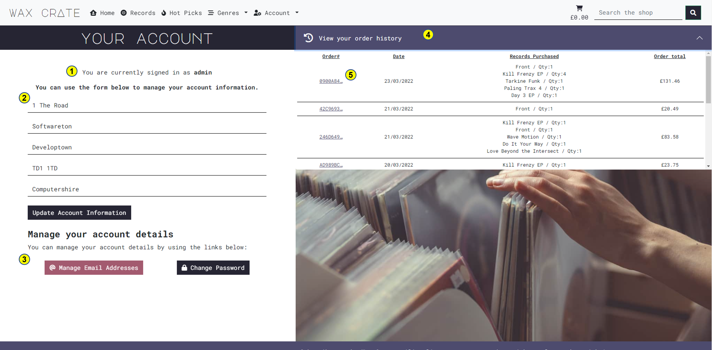

1. **Signed in as** - To provide feedback to the user, I've inserted a statement before the customer account form to advise who they are currently logged in as.

2. **Customer Account Form** - (Partially satisfies User Story 11) This form allows users to enter their default information. It's rendered from the forms.py file in the accounts app. All the validation is handled by django. If the user checks the save info box during the checkout process, their checkout information is stored in the model this form is rendered from.

3. **All Auth Integration** - (Partially statisfies User Story 9) I've included some more involved integration with the Django All Auth package here by providing links to the manage email address template and the change password template within the accounts app.

| Manage Emails Screen                                    | Change Password                                             |
|---------------------------------------------------------|-------------------------------------------------------------|
| 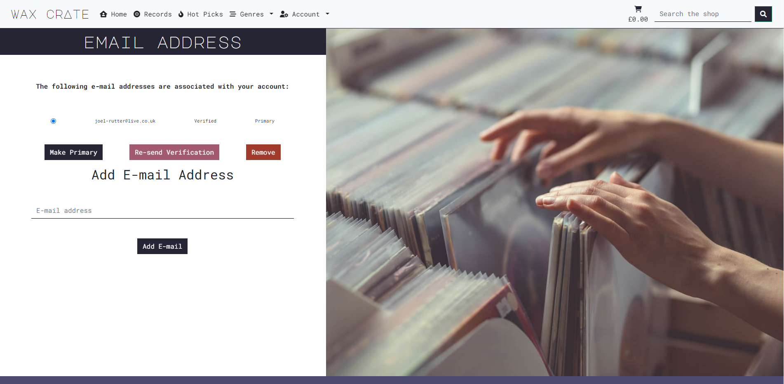  | 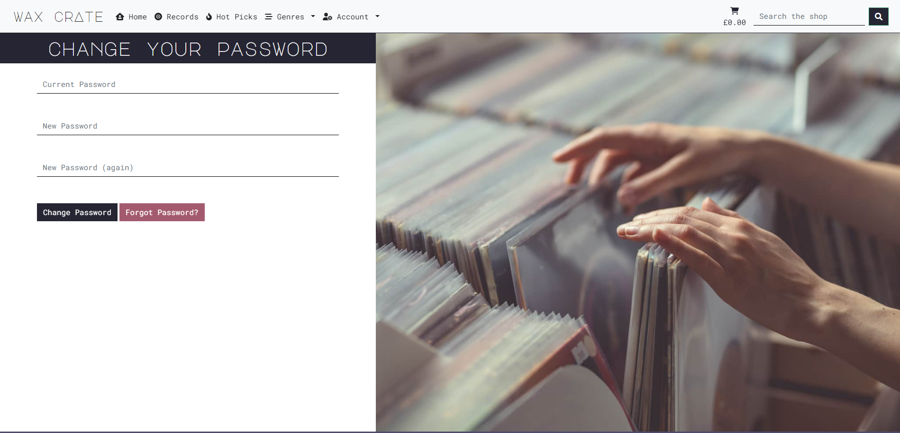  |

4. **Order History Accordion** - I've used a similar structure to the order summary here only this time rather than rendering records, I'm looping through the orders that are associated with this paticular Customer Account within the body of accordion.

5. **Detailed Order History** - This link pushes the order number down the URL and renders an amended checkout success page for that paticular order in the orders table. There is a message to inform the user that they are looking at a past order confirmation. I send a new context variable into the template within the order_details view to check if the user is accessing the checkout success page from the account template and if so, render a back to account button rather than a hot picks button.

## Registering, Sign In, Sign out & Account/Password Management
The final user stories remaining are all to do with authentication. I used Django all auth for this and as a result I won't explain the functionality as you can read more about the package in the documentation [here](https://django-allauth.readthedocs.io/en/latest/).

To summarise, I will detail the remaining user stories with screenshots of the customised all auth templates. I customised the templates in line with my custom accounts template to ensure visual consistency and promote familiarity within the site users. 

| * **User Story 7 - As a User I want to be able to quickly register for an account so that I can have my details saved.**                                            |
|---------------------------------------------------------------------------------------------------------------------------------------------------------------------|
| 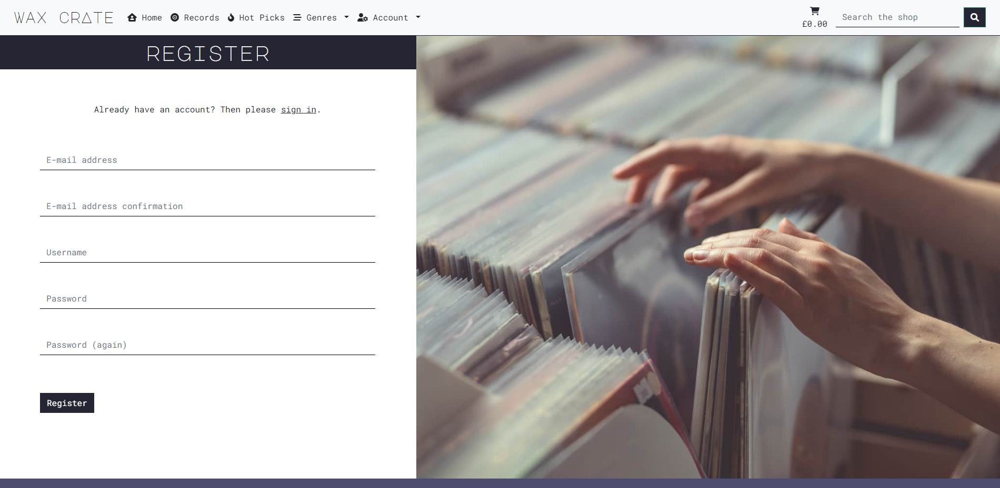                                                                                                                   |
| **User Story 8 - As a User I want to be able to quickly Log in and out so that I can access my account and keep my details secure.**                                |
| 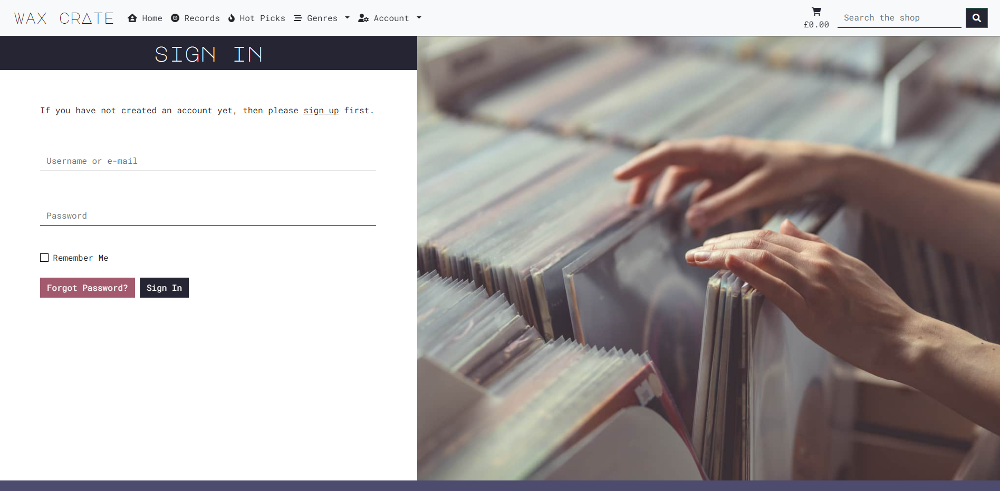                                                                                                                    |
| 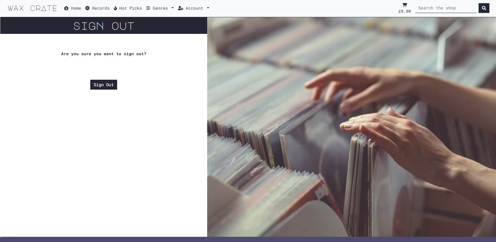                                                                                                                   |
| **User Story 9 - As a User I want to be able to change my password via email so that I can recover my account if I forget it.**                                     |
| 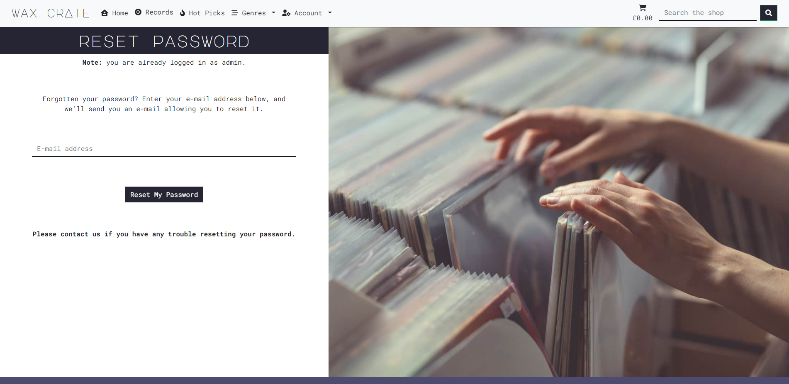                                                                                                             |
| **User Story 10 - As a User I want to receive a confirmation email when I have registered so that I can be sure that the site is reputable and verify my actions.** |
| 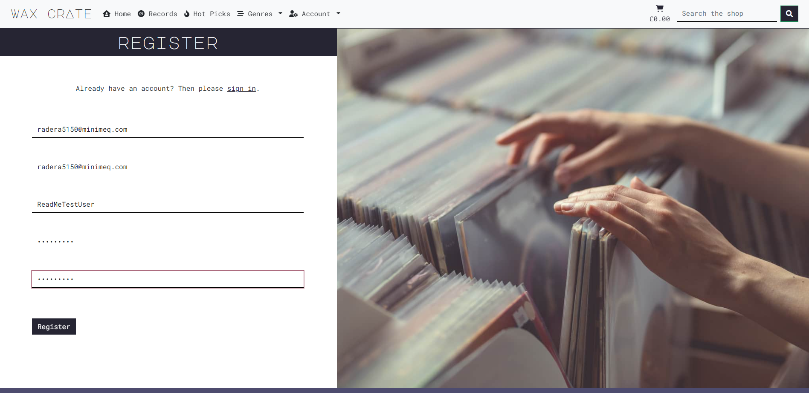                                                                                                 |
| 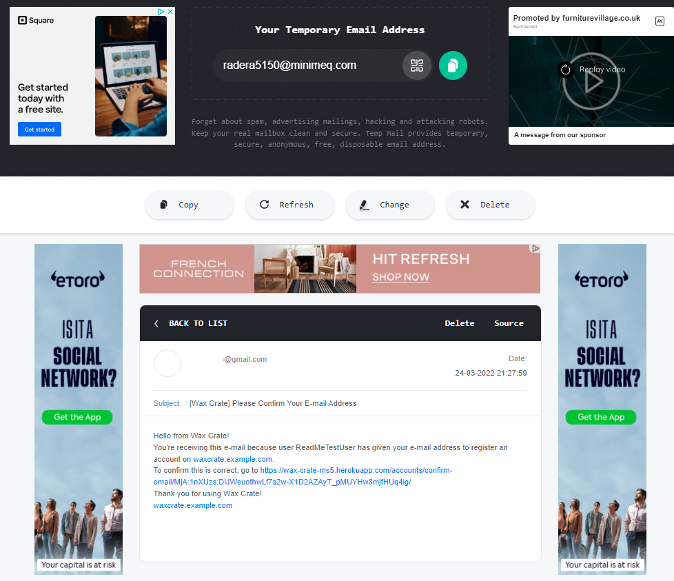                                                                                                       |

## **Additional Functionality**
Django handles a variety of errors internally using error handlers. These errors are 400, 403, 404 and 500. As Django is looking within my templates directory for my custom templates, the internal error handlers that handle the errors specified above would display a default template which is not akin to the UI that I have designed. As a result, I have added custom templates corresponding to the errors above in terms of file name (400.html, 403.html, 404.html, 500.html). As these templates are within my custom templates directory, the django error handler functions that are built in to the framework now use the custom templates rather than the blank templates. My custom templates extend from the base.html template and provide the user with the error that has occured. They also provide the user with a link back to the home page so that they don't have to use the navigation or their browser buttons to get back. The example below is for the 404 template, the template is the same for all of them apart from they are named differently according to their error type and display the relevant content for that error.

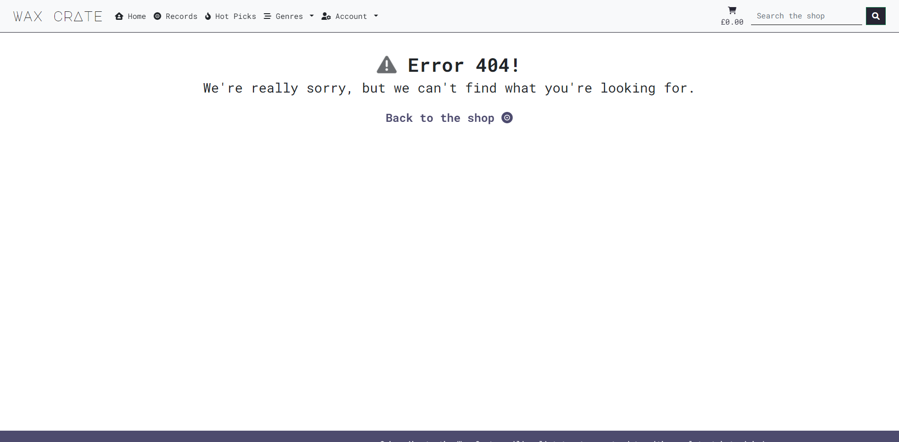

# **Technologies Used**
Below I will list the variety of technology I used during the development process.
### **Operating Systems**

* **[Windows 10](https://www.microsoft.com/en-gb/windows/get-windows-10)**

### **GitPod** - was used as an Integrated Development Environment.  

### **Languages**

* **[Python](https://en.wikipedia.org/wiki/Python_(programming_language))**
    I did use some built in packages here throughout such as json and the time packages. I used json where the cart is concerned in some of the back end functionality and I used time within the webhook handler functions to sleep the program for a second at a time for five seconds to account for checking the database for a created order before allowing stripe to create it.
    I also used the OS module within my environment to securely pass environment variable values from my untracked env.py file to my settings file and beyond.
* **[HTML5](https://en.wikipedia.org/wiki/HTML5)**
* **[CSS3](https://en.wikipedia.org/wiki/CSS)**
	* **[CSS Grid]( https://en.wikipedia.org/wiki/CSS_grid_layout)** – I used this for my data parent containers on larger screens to ensure that the layout of the application remained tidy and responsive even with variable amounts of data within the containers.
    * **[CSS Grid Generator]( https://cssgrid-generator.netlify.app/)** - To make things easier for myself, I used a CSS grid generator to create my grid containers.
* **[JavaScript](https://en.wikipedia.org/wiki/JavaScript)** - ES6 Syntax. I used some vanilla JavaScript to set a timeout function on my django messages.

### Ecommerce Elements
* **[Stripe](https://stripe.com/gb)** - Stripe provides APIs that web developers can use to integrate payment processing into their websites and mobile applications.
* **Gmail** - I used Gmail's SMTP server to send mail from the application whilst in the production environment.
### **Frameworks, Libraries & Dependencies**
#### **Backend**
* **[Django]( https://www.djangoproject.com/)** - This is the high-level python framework I used as the foundation of the project. It has a lot of useful pre-installed packages and shortcuts and is intended to be used for the rapid development of applications.
    * **[Django Summernote](https://github.com/summernote/django-summernote)** - This is a Django admin library that I installed to allow admins within the site to generate content with higher semantic value to improve layout and search engine optimisation. You can read about the implementation procedure in the attached documents via the link.
    * **[Django all-auth](https://django-allauth.readthedocs.io/en/latest/overview.html)** - This is another Django library that handles the authentication and creation of users.
    * **[Django Crispy Forms](https://django-crispy-forms.readthedocs.io/en/latest/)** - A Django package to contorl the rendering behaviour of forms, in my case to render forms with bootstrap styling. You read about the implementation procedure in the docs available via the link.
    * **[Django Storages](https://django-storages.readthedocs.io/en/latest/)** - A collection of storage backends used for integrating django with AWS S3. You can read more about it in the documentation via the the link.
* **[Pillow](https://pillow.readthedocs.io/en/stable/)** - This is a python image interpreter which allows the processing of image files via python code. In my case, it's required as one of the fields on my models is an image field. You can read about the implementation procedure in the docs via the link.
* **[Green Unicorn](https://gunicorn.org/)** - This is a Web Services Gateway Interface HTTP server which is commonly used to run Python web applications. 
* **[Dj-database-url](https://pypi.org/project/dj-database-url/)** - This Django library allows us to connect to an external database which in our case will be hosted on Heroku.
* **[psycopg2](https://pypi.org/project/psycopg2/)** - This package is one of the most popular database adapters for the python programming language which allows us to utilise a PostgreSQL database.
* **[PostgreSQL](https://www.postgresql.org/)** - The relational database management system used within this application.
#### Front end 
* **[Bootstrap]( https://getbootstrap.com/)** - a free and open-source CSS framework directed at responsive, mobile-first front-end web development. It contains CSS- and (optionally) JavaScript-based design templates for typography, forms, buttons, navigation, and other interface components.
* **[jQuery]( https://jquery.com/)** - jQuery is a fast, small, and feature-rich JavaScript library. It makes things like HTML document traversal and manipulation, event handling, animation, and Ajax much simpler with an easy-to-use API that works across a multitude of browsers. I've used throughout the app for various tasks ranging from removing rendered objects that I didn't like from Django to changing IDs so that they are unique post render and adding aria labels to elements to increase accessibility.
* **[Hover.css](https://ianlunn.github.io/Hover/)** - A collection of CSS3 powered hover effects to be applied to links, buttons, logos, SVG, featured images and so on.
* **[Google Fonts](https://fonts.google.com/)** - for typography
* **[Font Awesome](https://fontawesome.com/)** - for iconography  

### **Version Control**
* **[Git](https://en.wikipedia.org/wiki/Git)** - was used as a version control system.
* **[GitHub](https://en.wikipedia.org/wiki/GitHub)** - was used as a code repository.
### **Deployment**
* **[Heroku](https://en.wikipedia.org/wiki/Heroku)** – A cloud hosting service where the finalised application is deployed.
* **[Amazon Web Services S3](https://aws.amazon.com/s3/)** - Amazon Simple Storage Service is a service offered by Amazon Web Services that provides object storage through a web service interface. In my case, it was used as a storage solution for my static and media files
### **Other**
* **[Microsoft Visio](https://en.wikipedia.org/wiki/Microsoft_Visio)** - Was used to create the front end wireframes and database schema.  
* **[Microsoft Powerpoint](https://en.wikipedia.org/wiki/Microsoft_PowerPoint)** - Used to plan the application features, the data model, write user stories, prepare images for use in this document, prepare the colour palette, write questions for my mentor and just general planning. 
* **[Microsoft Excel](https://en.wikipedia.org/wiki/Microsoft_Excel)** - I used this spreadsheeting tool to create and complete my manual testing spreadsheet.
* **[Markdown Table From Excel](https://thisdavej.com/copy-table-in-excel-and-paste-as-a-markdown-table/)** - A nifty tool I've been using to save time in terms of my markdown tables. All you need to do is create your content via excel, highlight the cells and then copy them into the text field where they will be converted to markdown syntax.

# **Application Testing**  
Please click [here](testing.md) to see a full breakdown of all testing completed on the application.

# **Preparing the workspace and deploying the application**
Please click [here](prep-and-deployment.md) to see a full explanation of the steps I took to prepare the workspace for development, how to perform an initial deployment, the integration and implementation of additional libraries as well as the final deployment of the application.

## **Forking the repository**
Should you wish to use the site code inside the repository without affecting the original repository, you can make a fork and create a copy of the repository which you can view and amend the code within. To create a fork, follow these steps:
1. Login to [GitHub](https://github.com/) and locate the [wax-crate-ms5](https://github.com/JoelMichaelRutter/wax_crate_MS5) repository.
2. In the top right-hand corner of the repository, you will see three buttons just below your profile icon. The rightmost button is called “fork”. Click this button.  
3. The repository will now be copied to your own GitHub account.

## **Cloning the repository**
You can create a clone of the repository inside your development environment. To do this, follow these steps:
1. Login to [GitHub](https://github.com/) and locate the [wax-crate-ms5](https://github.com/JoelMichaelRutter/wax_crate_MS5) repository.
2. Whilst in the repository, you will see the various files contained within. Above this list, you will see a button labelled “code”. The button will have a small download icon beside it.  
3.	When you click this icon, a small dropdown will open. Inside the dropdown will be the URL for the deployed site. Copy this URL by clicking the clipboard icon.  
4.	Open the Git Pod integrated development environment. 
5.	Whilst in the development environment, navigate to the bash terminal.
6.	In the bash terminal, enter “git clone”, then paste in the URL copied from the GitHub repository and hit enter.
7.	A clone of all files will now be pulled into the workspace.

It’s worth noting that you will also need to create your environment variables either via your IDE or an env.py file. You will also need to run the following command: pip3 install -r requirements.txt wich will install all of the dependencies from my requirements.txt file into your workspace.

The command above will download all the dependencies you need for a clone of the project in it’s current state based on the dependencies within the requirements.txt file.

# **Further Development Scope**

There a couple of areas I would develop this further in another development cycle. 

1. I would implement some sort of inventory management system by augmenting the Record model with a quantity_in_stock integer field. I would then probably use some sort of logic within the checkout/checkout success view to reduce the quantity of that record in the database by the quantity that the user just checked out with. This could include some sort of template logic on the records cards whereby the quantity in stock is rendered on the card and if it is 0, the card could gray out and the buttons would be disabled. That would probably raise some questions around the record details views and add to cart views as they would need some sort of defensive logic to ensure that users couldn't add out of stock records to the cart via the URL pattern.

2. I would implement some sort of contact messaging system. My first idea regarding this would be to have a contact form and then have an extra back office area to receive these messages into. I thought about this abit more in the shower today and it would probably be entirely possible to have an almost instant messenger by adding a messages model to the Accounts app and then having some fields in that model for user and store messages and augmenting the account model to have a some sort of OneToMany field for the messages. I.E one account can have many messages back and forth from the store. No doubt, this would take a considerable amount more thinking but I'm sure you catch my drift.

# **Project Reflection**

This has been a really tough project for me. It has been on a scale that none of the other projects have been. I'm really pleased with how far I have come on this course. I never would have thought that I would understand the complex logic involved with this type of application when I first set out on this journey. Overall, I am really pleased with the way the project turned out and I'm excited to put these skills to use in the real world.

# **Project Credits**
## **Code**
In no particular order, I’d like to list the sources I pulled inspiration, code and debugging advice from.

* Thanks to r92 for the regex pattern I used on my rendered release year fields on this stack overflow [thread](https://stackoverflow.com/questions/4374185/regular-expression-match-to-test-for-a-valid-year).
* Thanks to Spencer Wieczorek here on this Stack overflow [thread](https://stackoverflow.com/questions/39539967/make-duplicate-ids-unique-using-jquery
) for his idea on making duplicate ids unique, this helped whilst validating my Back Office html file due to the duplicated genre fields.
* Thanks to harm manders on this stack overflow [thread](https://stackoverflow.com/questions/66335238/changing-the-color-arrow-in-bootstrap), it really helped me in terms of overriding the colour of the bootstrap accordion buttons as I recoloured all of mine to darker colours.

* Thanks to Code Institute for their awesome content in preparing me and guiding me through this.
# **Project Acknowledgements**
* **Code Institute Tutor Support** - For pushing me in the right direction with tricky bugs, I would specifically like to mention James and Scott who have been amazing.
* **My Mentor** - Chris Quinn, as always for keeping me real, for his useful feedback and general greatness.
* **My Partner** - Charlotte Howard, for proof reading my work, content and her marketing genius. 