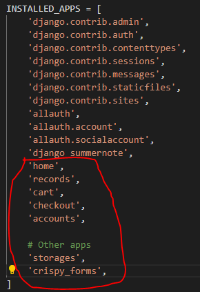
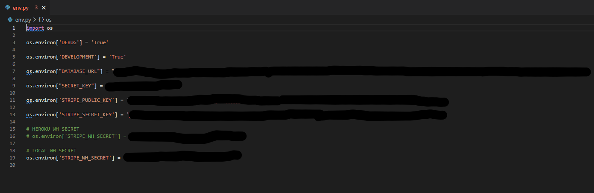
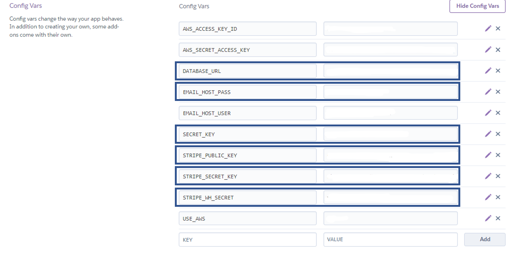

# **Wax Crate Deployment Documentation**
When deploying this application, I deployed very early on in the development stages to ensure that I had a solid platform to work on and to ensure that I didn’t run in to any problems towards the project submission. I also wanted to get set up on my production database as soon as possible so that I could begin to fill it with entries. If you wish to use this code as a starting point for your own project, I recommend adopting the same philosophy. The way I developed this application might seem a little backwards. I'm going to break this down into a few significant sections.

* ### [Project Set Up](#project-set-up)
* ### [AWS Set Up](#aws-set-up)
* ### [Deployment](#deploying-to-heroku)
* ### [Stripe Set Up](#stripe-set-up-settings)
* ### [Production Email Set Up](#production-email-set-up)


# **<a id="project-set-up"></a>Project Set Up**

I used the Code Institute GitPod full template to start this project which came with a Git repository already initialised so you will need to account for that. 

Also, rather than having to go and install the dependencies yourself manually, you should ensure that you have a copy of my requirements.txt file as then you can just issue the following command in the terminal "pip3 install -r requirements.txt" which will install all the dependencies you need to get started. Once all the project packages and dependencies have been installed you will be able to follow my processes outlined below.

Also, if you do add to this project in terms of the dependencies and libraries used, you will need to freeze those libraries into the requirements.txt file by issuing the following command to the terminal "pip3 freeze --local > requirements.txt". Failure to do this will mean that when the app is deployed to Heroku, it wont be able to download and install the dependencies the app needs to run.

Once I had all my dependencies installed, I started the development of my app by issuing the following command to in the terminal "django-admin startproject wax_crate". This created my project level directory, off which the rest of the app is supported.

Now that I had the project started, I created the first app within the project (this being the "home" app) by issuing the following command to the terminal "python3 manage.py startapp home". This step was followed for each of the additional apps I created for the project. Every time that this step is completed, I had to return to the project settings.py file and add the newly created app to the list of installed apps. You can see this demonstrated in the screenshot below:



Any time that a new app is added or any time that a data model is changed there are few commands that you will need to issue. As a genreal rule of thumb, I like to run a few extra commands just to make sure anything I'm migrating to the database is correct. Just before I detail the commands, if you switch databases and you haven't made the migrations on the new database, you will have to run the migrations again. The commands are:

1. python3 manage.py makemigrations --dry-run - This shows a dry run of the creation of the migrations script without actually making the migrations, this allows you to check that the migrations are within the scope that you require. 

2. python3 manage.py makemigrations - This creates a migrations script.

3. python3 manage.py migrate --plan - This plans all of the migrations scripts that have been created and allows you to check the scope before the migration scripts are pushed to the database.

4. python3 manage.py migrate - This command pushes the scripts to the database.

To check that Django is installed correctly, type python3 manage.py runserver into the terminal, and you should see the Django success message.

## **Setting up the Heroku App & Database
1. Go to [Heroku](https://id.heroku.com/login) and signup for an account if you don’t already have one. If you do, sign in so that you can see the Heroku dashboard. 
5. Click the new button in the top right hand section and select “Create New App”
6. Give the application a name and select the region. When selecting a region, select the option that is closest to you. 
7. Click the “Create App” button at the bottom of the form.
8. Once the app is created, select it by clicking the application name.
### **Application Dashboard**
At this stage, I installed some add ons into the application to serve as the database. 
### **Resources Tab**
1. In the application dashboard, select the resources tab.
2. In the resources tab, in the search bar type “Heroku Postgres”. When it appears as an option in the drop down, select it.
3. Following the above step will open an order form. For the purposes of this project, I left the “Plan Name” field as “Hobby Dev – Free”. If you deploy this application yourself, depending on the scope of the application and its use, you may need to select something different. 
4. Click “Submit order form”.
5. You will now see that the “Heroku Postgres” add on is included in the “add-ons” section of the Heroku application. This will serve as our database whilst the application is deployed. I used this database from very early on the project

### **Settings Tab**
We have completed the necessary steps in the “Resources” tab now. Once the above has been completed, click the “Settings” tab and follow the steps below.

1. In the settings tab, click the “Reveal Config Vars” button. Contained within this section, we will detail our environment variables such as database URL, secret keys and other environment variables. These variables allow the project to function once deployed (Note: Some of the details within this section will be redacted for security purposes but I will explain the processes that need to be followed. 

2. Upon revealing the config vars, you will see text fields. One of the fields will already be populated with the “DATABASE_URL” variable. You must copy the value assigned to this variable as you will need to use it in your project to serve as the connection to the Heroku Postgres database add on we added in the previous section.

3. Once the string of text assigned to the “DATABASE_URL” variable has been copied, return to the workspace.

## **Creating an env.py file**

Now that the Heroku app is set up and the PostgreSQL database has been added, I created an env.py file within my workspace. I will show a screenshot of my env.py file below but I've redacted the variable values so as to keep my application secure. The env.py file is an untracked file so it wont appear in the GitHub repository. In my case, it was included in my gitignore file so you would need to consider doing something similar. I'm going to show you the completed env.py file from my project but just to be super clear, I built these variables up over the course of a few weeks of development.



I've imported the os module at the top of the file to set the variables in the environment. Using the module allows for the values of my environment variables to be passed through the operating systems between tracked and non tracked files and hidden by the variable name as opposed to hard coding them.

1. DEBUG & DEVELOPMENT - These two variables are responsible for switching key settings such as switching DEBUG to False in production and changing the email back end from the Gmail account in production to the console version in development.
2. I've created a DATABASE_URL variable and given it the value I copied from Heroku. I then access this variable in the settings.py file and using dj_database_url, connect to the external database. Theres a conditional check involved in this to see whether the DATABASE_URL is True in the environment. If true, I'm using my external database and if false, Im using the SQL lite database that comes with django. 
3. SECRET_KEY - I set this myself as an alpha numeric string and pulled it into the settings.py file to set the SECRET_KEY setting via the environment variable using the os.environ.get() method.
4. STRIPE KEYS - To access these values, you need to go and sign up for a Stripe account and then in the developer dashboard you will be able to access your "publishable key" which you should assign to the STRIPE_PUBLIC_KEY variable, the secret key, which you should assign to the STRIPE_SECRET_KEY environment variable and finally the two webhook signing secrets. You can only access these by setting up a webhook endpoint in the stripe developer dashboard. You will notice that I have two that was becuase I set up two webhook endpoints, one for my development environment (which required its own webhook signing secret) and my deployed version. One tip I would give with this is watch the URL that your local development site is on as it will sometimes change slightly and as a result, if you try to process a payment via Stripe and the URL of the local running version of the server has changed, it will give you a 500 response on stripe. Fortunatley, the Heroku webhook endpoint is completley static and does not change. 

Once you have created your env.py file, you need to replicate it within the Heroku config vars as the env.py file will not be accessible when the site is deployed.

You can see from my example below, that I have duplicated the variables from my env.py file and their values (redacted) into the Heroku config vars (for the STRIPE_WH_SECRET i used the specific key generated when I set up my Heroku webhook endpoint). Just note, there are some environment variables for AWS and the production email client in there, just ignore them for the moment and focus on the database url, the secret key, and the stripe keys for now:



At this stage in the process, I left Heroku alone for the time being whilst I completed some additional steps towards setting up my AWS bucket and a very small piece of development in the home screen of the app prior to deploying. It was important at me to get all of the required functionality in Heroku and AWS set up to build on as a solid foundation. I'm going to talk you through the AWS set up process and then the final Heroku steps I took to get the fledgling version of the app up and running.

# **[AWS Set Up](#aws-set-up)**
As the site is being deployed to Heroku, I decided to use Amazon Web Services' S3 cloud hosting service to store my static and media files. I followed the following steps to set up an account and integrate it into my project.
## Registering and Setting Up A Bucket
1. Go to [aws.amazon.com](https://aws.amazon.com/) and register for an account.
2. Once registered, you will be at the management console. You need to find the S3 service in the search bar. 
3. Once you've accessed S3, you need click "Create Bucket" button. This bucket will be the place where the static and media files will be stored.
4. You will need to give your bucket a name, I named mine according the name of my application on Heroku.
5. You will now need to select a region, select the one that is closest to you.
6. Make sure that you select the radio button to enable "ACLs".
7. Make sure that you check the radio button "Bucket Ownership preferred".
8. Click "Create Bucket".
9. Scroll right down to the bottom of the page and find the properties section. 
10. In the properties section, select "Static Website Hosting" and fill in the index and error values as "index.html" and "error.html".
11. Now go to the permissions tab.
12. Find the CORS configuration section. Within this section, I set up the connection between the Heroku app I set up and the S3 bucket.
13. Within the code editor on the CORS configuration page, paste in the below code.
```python
[
  {
      "AllowedHeaders": [
          "Authorization"
      ],
      "AllowedMethods": [
          "GET"
      ],
      "AllowedOrigins": [
          "*"
      ],
      "ExposeHeaders": []
  }
]
```
14. Within the permission section, navigate to the bucket policy section and select the "policy generator". This is used to generate a security policy for the bucket open this in a new tab so that you can easily come back to the previous page without losing your progress.
15. In the security policy form enter the following details
16. Policy Type - Select 23 Bucket Policy
17. Principal - Enter a "*" to allow all principals.
18. Actions - Select "Get object".
19. In the ARN field, copy the ARN number from the previous page and paste it into the field.
20. Click "Add Statement".
21. Click "generate policy".
22. The security policy will be generated in object format. Copy the entire policy.
23. Return to the bucket policy screen and copy the object into the bucket policy code editor.
24. In the object editor, look for the "Resource". The value should be set to the ARN. At the end of the value, add a "/*" to allow full access to all resources the bucket.
25. In the permissions tab, locate the Access Control List. click edit and enable List for Everyone (public access) and accept the warning box. If the edit button is disabled you need to change the Object Ownership section to ACLs enabled.
At this point, the S3 bucket is set up but there are a few more steps that need to be followed.

## Creating a User to Access the Bucket
All of this functionality is handled by IAM, another AWS service. Follow the steps below to set this up:
1. Go back to the services menu on the AWS console and find IAM. 
2. In the sidebar, select "User Groups".
3. Click "Create a New Group".
4. Name your group, in my case I named it "manage-wax-crate-ms5" and click the next step button until you see the "Create Group" button. Click the "Create Group" button.
5. Navigate to the policies section in the side bar.
6. Click the create policy button. 
7. Navigate to the JSON tab and click the "import managed policy" link.
8. In the form that opens, search for the "S3 Full Access" policy adn import it. 
9. Get the ARN from the bucket policy and paste it into the resource key value field but add two values in a list format. In my case, I added the below:
```python
"Resource": [
    "arn:aws:s3:::wax-crate-ms5",
    "arn:aws:s3:::wax-crate-ms5/*"
]
```
10. Click "Review policy"
11. Give the policy a name and description, I called mine "jr-wax-crate-policy".
12. Click "Create Policy".
13. Navigate back to the groups section. We now need to attach the policy we just created to the group.
14. Locate the manage group you just set up, in my case it was called "manage-wax-crate-ms5".
15. Click attach policy.
16. Search for the policy that was just created, in my case it was "jr-wax-crate-policy".
17. Select the policy via the checkbox and click "Attach Policy".

To create a user to put into the group, follow the below steps:

1. Navigate to the users section and click "add user".
2. Create a user, in my case I named my user "wax-crate-staticfiles-user".
3. Ensure that the programmatic access checkbox is checked.
4. Click the next button.
5. Add the user to the "manage-wax-crate-ms5" group.
6. Click through to the end and click "Create User".
7. You will be asked to download a CSV file containing the access credentials. These are really important and can only be downloaded once so please keep them safe. They will also be required to set up the relevant AWS environment variables in Heroku.
