# **Wax Crate Application Testing Document**
## **Testing approach**
I wanted to adopt a hybrid approach to testing and do some automated testing and then resort to manual testing. As a result, I think that my application is pretty watertight from bugs.
## **Issues During the Development Process**
In all honesty, I didn’t come across too many issues in the development process. I had a couple of issues here and there which I will detail below:

1. In terms of URL patterns as one of my URLs takes a slug and some take integers and that was causing some pain until I moved the slug URL to the end of the pattern list. 
2. I also had a nightmare when my code stopped working randomly, turned out it was because I deleted a record from my store that I had in my cart.
3. I had a few problems in terms of my combined CRUD functionality in the Back Office template as I was trying to render the edit form in that particular template as well by using a context variable from the view called "from_edit" which would be checked and if so, the edit form would be rendered prepopulated as opposed to the add form. The framework didn't really appreciate what I was trying to do here so I had to split it out into the back office and edit record templates which is fine.

## **Validation issues**
My own HTML code had a fair few issues in terms of validation. Mostly duplicate IDs. Some of these were more tricky to fix than others, as my back office template has two elements rendered by Django with an ID of "id_genre", I had to use some JavaScript to make these unique. 

I have some outstanding HTML validation problems across the site however, the HTML in question is not being rendered by me but the third party packages I've used in Stripe and Summernote. I will detail screenshots of all outstanding validation issues below and you will be able to see from context and looking at the actual HTML files that this code is only generated on render. I was tempted to fix this post render with some JavaScript but I feel as though it will open a can of worms in the future, I checked with my mentor and tutor support and they said that I wasn't responsible for the errors coming from third party code.

A lot of these errors are the same and are being pushed by Stripe and then on the back office and edit pages, it's Stripe & Summernote throwing the errors.

<b>index.html</b>

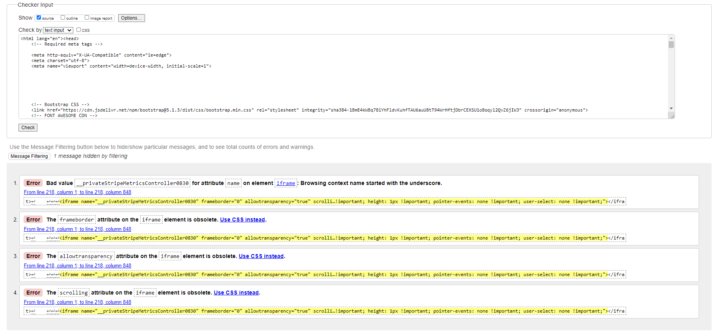

<b>records.html</b>

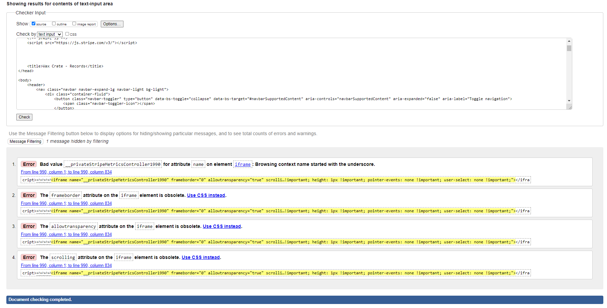

<b>record_details.html</b>

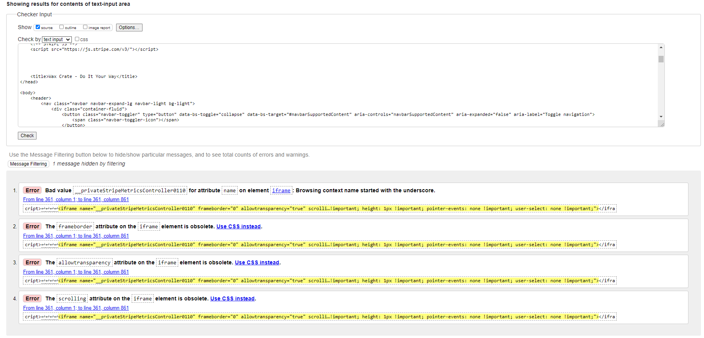

Summernote is also placing a font element into the track list content but it’s displaying as it should, if you check my code, it isn't anything that I coded.
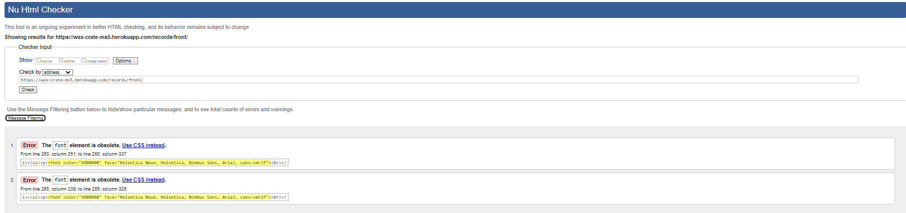

<b>cart.html</b>

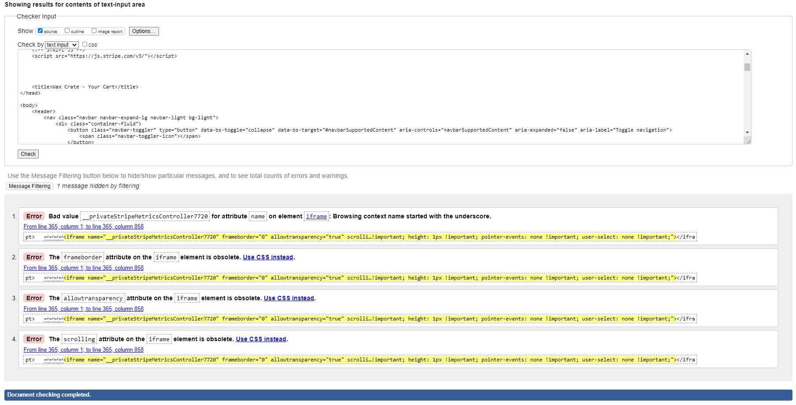

<b>checkout.html</b>

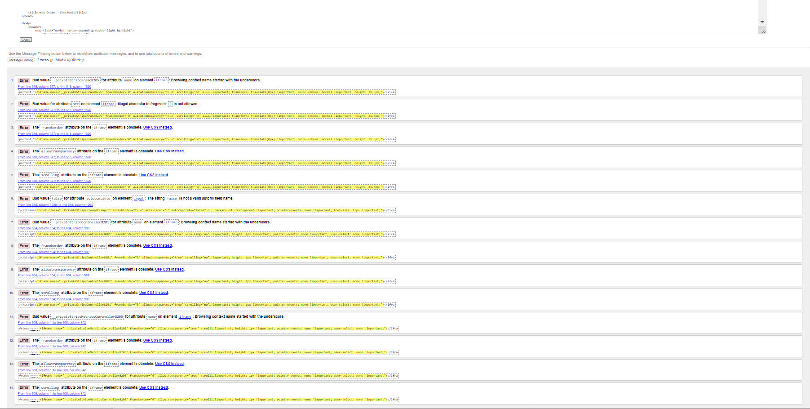

<b>checkout_success.html</b>

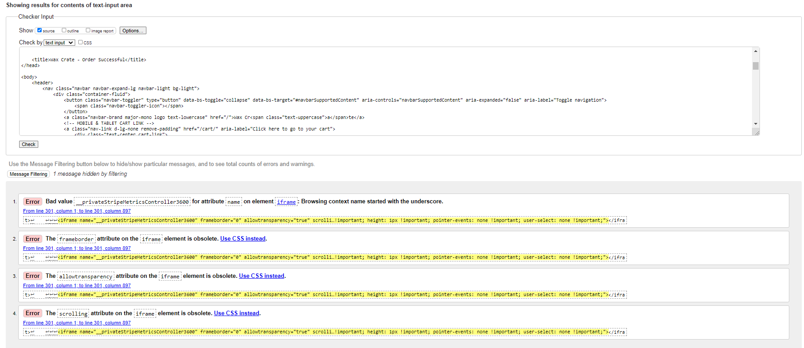

<b>account.html</b>

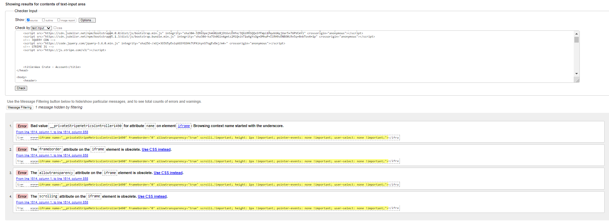

<b>backoffice.html</b>

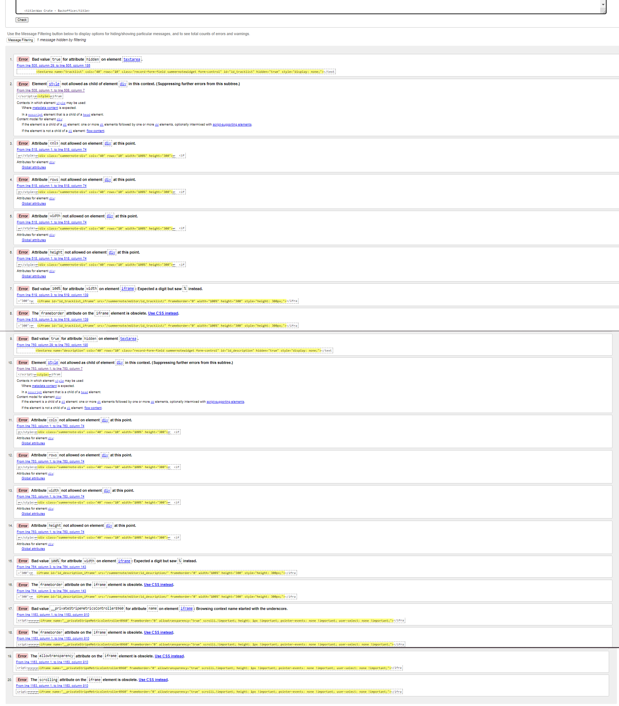

<b>edit record.html</b>

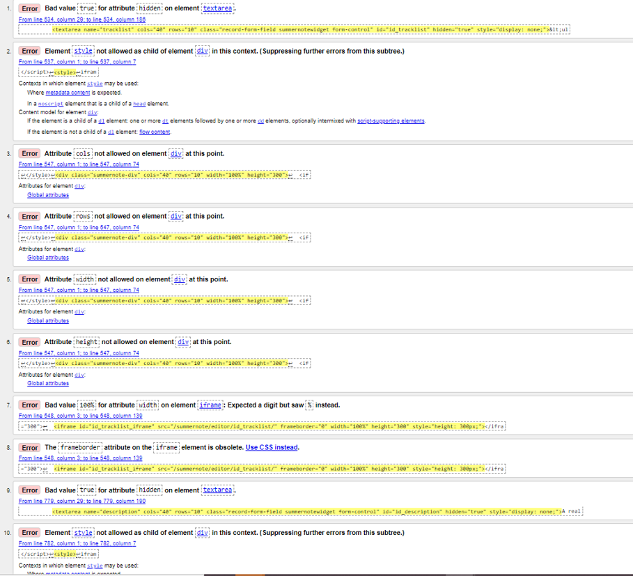

## **Automated Testing**
I've written 67 automated tests across the entire application to test models, model methods, views and forms. The context of the tests ranges from ensuring model methods are working correctly, to view security and accuracy and form rendering/validation. I will provide links to the tests app by app below.

<b>Home App</b>

* [Test Views](home/test_views.py)

<b>Records App</b>

* [Test Models](records/test_models.py)
* [Test Views](records/test_views.py)
* [Test Forms](records/test_forms.py)

<b>Cart App</b>

* [Test Views](cart/test_views.py)

<b>Checkout App</b>

* [Test Models](checkout/test_models.py)
* [Test Views](checkout/test_views.py)
* [Test Forms](checkout/test_forms.py)

<b>Accounts App</b>

* [Test Models](accounts/test_models.py)
* [Test Views](accounts/test_views.py)
* [Test Forms](accounts/test_forms.py)

To run the tests if you clone this repository, you will need to go to the settings.py file and disable any production databases you have set up as you want to ensure you aren’t running tests on database with live data. You will want to be using the SQL lite database that comes with Django. 

Once the local Django database has been enabled, to run the tests, you should enter "python3 manage.py test" into the terminal. Provided all the code is functioning as it should, you should see 67 tests passed as demonstrated below:

## **Manual Testing**
Like I mentioned a moment ago, I have done some very extensive manual testing on my application on several devices. To do so, I created a checklist using Excel. You can access the completed checklist [here](testing-md-files/files/wax-crate-manual-testing.xlsx). Just note you will need to download it to view it. I've tried to get these to render in as markdown tables but because of the considerable amount of testing completed and the layout of my testing checklist, it would be impractical and would make this markdown document really really really long.

Just to make things easy, I will summarise the bugs I encountered during the testing process.

Largely, the errors I found were cosmetic, mostly height related when it came to images but there were some small functional bugs.

* **VISUAL BUG (facebook link)** - On click, the colour of the link is changing from the contrasting grey colour to black. 
    * **FIX** - Add fb link class to override element hover pseudo selector on hover. Now that link remains same colour when hovered, add hvr-grow hover.css class to provide visual feedback to the user.

* **VISUAL BUG (Firefox QTY Selector)** - Looks like this was specific to Firefox. I think it was misinterpreting the flex layout here. Was rendering the input at full width when Chrome was rendering it within the constraints of the flex container so it really spoiled the layout.

    * **FIX** - Had a look at the literal size of the input on chrome for the same viewport size and added an explicit width of the same size which fixed the problem. This was strictly on Firefox for mobile and it didn’t happen again once the fix had been implemented.  

* **FUNCTIONAL BUG** (Update Cart Functionality) - When multiple records were in the cart, the update button was not working for all records, only the last. This was due to the JavaScript recognising the click event of the button and looking for the nearest form with a matching class.

    * **FIX** - I tried using the prev() jquery method to look up the dom for the form related to each record but that didnt work. I suspect that its because of the grid layout I've used. Tried the prevAll() method and that was also unsuccessful. I realised that I needed to make each class unique so rendered the record id at the end of each class name in the edit-qty-remove-form-{{ record.record_id }}. Then used similar logic to the delete button by adding an id with the record ID in it, splitting that id within the JavaScript and then passing it to the form jQuery selector in a template literal so that each form could be found based on its corresponding unique class value. Tested again, and it now functions as expected.

* **FUNCTIONAL BUG** (Integrity Error Flow) - I've built a try and except block within my add_record functionality due to the "title" field on the Record model having the unique constraint applied to it. I tried adding an already existing record to the database and rather than follow the intended flow of raising the integrity error and redirecting back to the add record form with an error message, Django was throwing a 500 error.

    * **FIX** - This was simple, I just got the flow slightly wrong and the try/except block was outside of the block that was being executed. A simple re-jigging of the code so that the try except block was within the if statement after the form validity check is completed solved the problem.

* **VISUAL BUG** (Tracklist & Description Containers - L - XL Screens) - The height of the track list container was causing problems on large screens, specifically on my laptop and iPad (when in landscape view) as it was pushing the description container right down against the footer which spoiled the layout a little.

    * **FIX** - A simple media query fix solved this problem by reducing the height of the track list container for those screen sizes.

* **VISUAL BUG** (Border Right on Checkout Form Fields on Portrait Tablet View) - Some of my checkout fields flex next to each other on larger screen sizes and then display block on mobile. To ensure that the fields can be told apart, I added some border right onto two of them which was not showing on my tablet screen size. I've run into this problem before with Bootstrap not including the specific pixel width of my iPad.
    * **FIX** - Added a custom breakpoint media query but decreased it by a pixel so that the border right was showing on iPads.

* **VISUAL BUG** (Hero Image Height Issues - Cross App) - I encountered some Hero Image issues across the app specifically on screen widths like landscape iPads and smaller laptops. Due to the condensed screen size, the text and content within my containers were wrapping and forcing the height of the container up but the hero images were still being styled by the general styling with a fixed height of 90vh. This more than enough space for large screens but on smaller screens it meant the image was cutting off leaving white space at the bottom. 

    * **FIX** - Where I encountered this issue, I had two fixes. Firstly, I added a media query to dictate that under 1440px, hero images should have height of 100% as then the content containers would dictate the height of the image and there would then be no space. This then gave rise to another problem in that if the content was really minimal (sign out page), the height of the container would shrink down and leave lots of space because it no longer had a fixed height on laptops. To counteract this, on the templates that had the lack of content, I added a laptop-height container around the content to ensure that the page stretched the height of the viewport. I've tested all of these fixes and they are all working as expected now.

# **Performance Testing**
To test the performance of the website, I used Google Lighthouse inside Chrome Dev Tools. Below I will outline the applications performance via the metrics provided by Google Lighthouse:

<b>index.html</b>

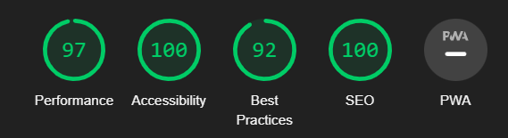

<b>records.html</b>

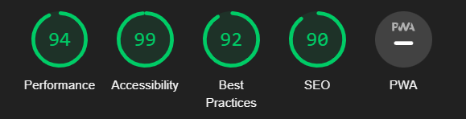

<b>records_details.html</b>

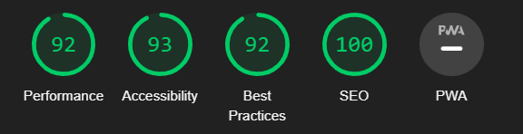

<b>cart.html</b>

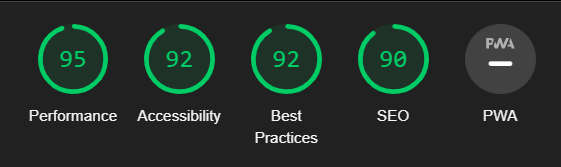

<b>checkout.html</b>

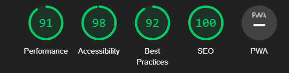

<b>checkout_success.html</b>

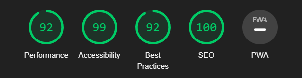

<b>backoffice.html</b>

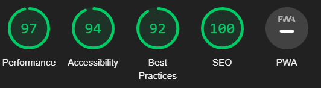

<b>edit_record.html</b>

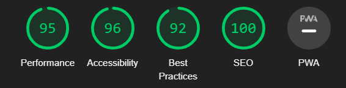

# **Known Issues**
I have a few known issues/errors that I haven’t been able to shake. 
1. In the workspace, I have some linter errors. I keep getting various models has no "X" objects member. This is not a valid error. I’ve tried to # noqa these so that they don’t appear, but the code is fully PEP8 compliant. These errors are just GitPod being weird. I confirmed this with tutor support.
2. I have some intermittent console warnings coming from what I assume is Summernote in terms of non-scrolling violations.
3. I have some PEP8 validation issues within the settings.py file, this file comes directly from the Django framework and no PEP8 issues are being caused by the code I’ve added so I’m leaving them alone for fear of angering the framework.
4. I have a few very small visual bugs in sticky Hover.css classes but they don't affect the user experience at all.
5. I have some outstanding HTML validation issues which I detailed earlier in the document. I want to stress that none of these are coming from code that I have written but from the third party Summernote and Stripe packages which are rendering HTML into the DOM. I've screenshotted all of the errors from the validator, and you will see the names of the DOM elements causing the problems. If you look at my code, you will find that they are not there as they are being rendered by the packages. I could write some JS to remove these pesky DOM elements post load, but I fear I would be opening a can of worms for the applications integrity future state.

# **Code Validation**
All my code has been validated through official sources. To ensure that I was checking all the relevant files, I completed checklists which are detailed below.
## **Python** 
All my custom python files have been validated through the [PEP8 online validator](http://pep8online.com/) with no errors or issues (the settings.py file has some line length errors but the strings where these errors occur are part of the framework).

| Python File Validation |                    |        |
|------------------------|--------------------|--------|
| Directory              | File               | Valid? |
| Project Level          | urls.py            | Valid  |
| home                   | views.py           | Valid  |
| home                   | urls.py            | Valid  |
| records                | views.py           | Valid  |
| records                | urls.py            | Valid  |
| records                | models.py          | Valid  |
| records                | forms.py           | Valid  |
| records                | contexts.py        | Valid  |
| records                | admin.py           | Valid  |
| cart                   | views.py           | Valid  |
| cart                   | urls.py            | Valid  |
| cart                   | contexts.py        | Valid  |
| checkout               | webhooks.py        | Valid  |
| checkout               | webhook_handler.py | Valid  |
| checkout               | views.py           | Valid  |
| checkout               | urls.py            | Valid  |
| checkout               | signals.py         | Valid  |
| checkout               | models.py          | Valid  |
| checkout               | forms.py           | Valid  |
| checkout               | apps.py            | Valid  |
| checkout               | admin.py           | Valid  |
| accounts               | urls.py            | Valid  |
| accounts               | models.py          | Valid  |
| accounts               | forms.py           | Valid  |
| accounts               | admin.py           | Valid  |
| home                   | test_views.py      | Valid  |
| records                | test_models.py     | Valid  |
| records                | test_views.py      | Valid  |
| records                | test_forms.py      | Valid  |
| cart                   | test_views.py      | Valid  |
| checkout               | test_models.py     | Valid  |
| checkout               | test_views.py      | Valid  |
| checkout               | test_forms.py      | Valid  |
| accounts               | test_models.py     | Valid  |
| accounts               | test_views.py      | Valid  |
| accounts               | test_forms.py      | Valid  |

## **HTML5**
All of my templates, once rendered in Heroku, have been validated through the [W3 Markup Validator](https://validator.w3.org/#validate-by-input) via direct input. Other than the third party errors, my own code is completely free of errors or warnings. To make sure I didn’t miss anything, I created a checklist.

| HTML Validation       |                                                                                                                  |
|-----------------------|------------------------------------------------------------------------------------------------------------------|
| Pages                 | Valid?                                                                                                           |
| index.html            | All of my own code is valid - Errors thrown from Summernote and Stripe - Validator screenshots to evidence this. |
| records.html          | All of my own code is valid - Errors thrown from Summernote and Stripe - Validator screenshots to evidence this. |
| record_details.html   | All of my own code is valid - Errors thrown from Summernote and Stripe - Validator screenshots to evidence this. |
| edit_record.html      | All of my own code is valid - Errors thrown from Summernote and Stripe - Validator screenshots to evidence this. |
| back_office.html      | All of my own code is valid - Errors thrown from Summernote and Stripe - Validator screenshots to evidence this. |
| cart.html             | All of my own code is valid - Errors thrown from Summernote and Stripe - Validator screenshots to evidence this. |
| checkout.html         | All of my own code is valid - Errors thrown from Summernote and Stripe - Validator screenshots to evidence this. |
| checkout_success.html | All of my own code is valid - Errors thrown from Summernote and Stripe - Validator screenshots to evidence this. |
| Account.html          | All of my own code is valid - Errors thrown from Summernote and Stripe - Validator screenshots to evidence this. |
| 400.html              | All of my own code is valid - Errors thrown from Summernote and Stripe - Validator screenshots to evidence this. |
| 403.html              | All of my own code is valid - Errors thrown from Summernote and Stripe - Validator screenshots to evidence this. |
| 404.html              | All of my own code is valid - Errors thrown from Summernote and Stripe - Validator screenshots to evidence this. |
| 500.html              | All of my own code is valid - Errors thrown from Summernote and Stripe - Validator screenshots to evidence this. |

## **CSS3**
My custom CSS file has been validated using the [W3 Jigsaw Validator](https://jigsaw.w3.org/css-validator/#validate_by_input) via direct input. No errors or warnings present. 

| CSS Validation |        |
|----------------|--------|
| Files          | Valid? |
| Base.css       | Valid  |
| checkout.css   | Valid  |
| Accounts.css   | Valid  |

## **JavaScript**
My custom JavaScript code has been validated through [JSHint](https://jshint.com/). No errors present.

| JS Validation               |        |
|-----------------------------|--------|
| Files /Scripts              | Valid? |
| base toast script           | Valid  |
| signup script               | Valid  |
| Password reset script       | Valid  |
| password reset from key     | Valid  |
| Password change script      | Valid  |
| Login script                | Valid  |
| Email custom script         | Valid  |
| qty input script            | Valid  |
| Edit cart script for button | Valid  |
| Delete from cart            | Valid  |
| stripe elements.js          | Valid  |

